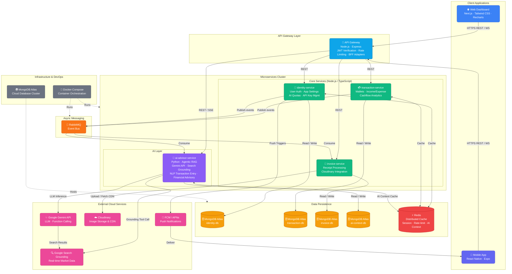

# System Architecture — FinTrack AI

> **Personal Finance Management Application**
> Architecture diagram depicting the full microservices topology, data flows, and external integrations.

---

## Subgraph Legend

| Colour | Layer |
|--------|-------|
| 🔵 Blue | Web client (Next.js) |
| 🟣 Indigo | Mobile client (React Native) |
| 🩵 Sky | API Gateway |
| 🟢 Emerald | Core Node.js microservices |
| 🟣 Violet | AI advisor service (Python) |
| 🟡 Amber | MongoDB Atlas databases |
| 🔴 Red | Redis cache |
| 🩷 Pink | External cloud services |
| 🟠 Orange | RabbitMQ message broker |
| ⬜ Gray | Infrastructure / DevOps |

---

## Key Architectural Decisions

| Decision | Rationale |
|---|---|
| **Database-per-Service** | Each microservice owns its MongoDB Atlas instance, enforcing strict data isolation and independent scalability. |
| **API Gateway BFF** | A single entry point handles JWT verification, rate limiting, and service-specific payload shaping (BFF adapters per service). |
| **Agentic RAG on ai-advisor-service** | Combines retrieval of user financial history with LLM reasoning and real-time Search Grounding, enabling grounded and personalised financial advice. |
| **RabbitMQ Event Bus** | Decouples services for cross-cutting concerns (e.g., transaction-created → AI context update, invoice-processed → transaction creation). |
| **Redis Distributed Cache** | Shared cache layer reduces MongoDB round-trips for sessions, rate-limit counters, and AI conversation context. |
