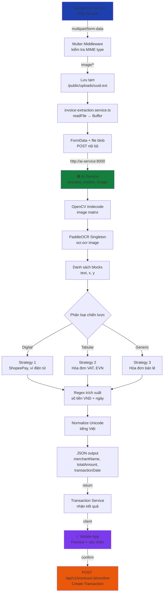
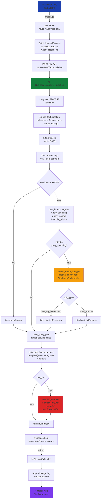
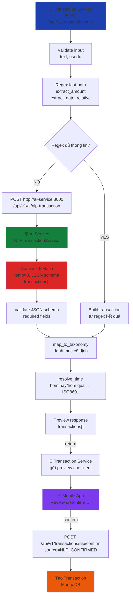

# CHƯƠNG 5: MÔ TẢ CHI TIẾT CÁC THÀNH PHẦN AI/NLP TÍCH HỢP

Hệ thống tích hợp ba thành phần AI/NLP độc lập, mỗi thành phần phụ trách một bài toán riêng biệt: nhận dạng hóa đơn bằng thị giác máy tính (OCR), phân loại ý định và trả lời truy vấn tài chính cá nhân (NLP Analytics Chat), và tư vấn tài chính chuyên sâu kết hợp dữ liệu thời gian thực (Agentic RAG Advisor). Cả ba thành phần đều được triển khai trong cùng một AI Service (FastAPI/Python, port 8000), giao tiếp nội bộ với các Node.js service qua Docker network `fintech_net`.

---

## 5.1. Thành phần 1: OCR Nhận dạng Hóa đơn

---

### 5.1.1. Mục tiêu

Tự động trích xuất ba trường thông tin cốt lõi từ ảnh hóa đơn do người dùng chụp bằng điện thoại: **tên người bán** (`merchantName`), **tổng tiền** (`totalAmount`), và **ngày giao dịch** (`transactionDate`). Mục tiêu là rút ngắn thời gian ghi nhận giao dịch từ hóa đơn giấy/điện tử xuống còn một bước xác nhận duy nhất thay vì nhập tay toàn bộ thông tin.

---

### 5.1.2. Đầu vào và Đầu ra

| | Mô tả |
|---|---|
| **Đầu vào** | File ảnh nhị phân (JPEG, PNG, WEBP, BMP) nhận qua `multipart/form-data`. Transaction Service đọc file từ disk (`/public/uploads/`) rồi POST nội bộ sang AI Service endpoint `POST /api/v1/ai/ocr`. |
| **Đầu ra** | JSON chuẩn hóa: `{ "success": true, "data": { "merchantName": string, "totalAmount": number\|null, "transactionDate": ISO8601\|null } }` |

---

### 5.1.3. Cách tiếp cận

**Hybrid: Deep Learning (PaddleOCR) + Rule-based post-processing.** PaddleOCR đảm nhận nhận dạng ký tự quang học (phát hiện vùng văn bản + nhận dạng ký tự). Phần trích xuất thông tin có cấu trúc (số tiền, ngày, tên người bán) sử dụng thuật toán heuristic dựa trên vị trí không gian (tọa độ `x`, `y` của từng block) và biểu thức chính quy (regex). Không dùng mô hình học máy cho bước hậu xử lý để đảm bảo tốc độ và khả năng giải thích (explainability).

---

### 5.1.4. Mô hình / Dịch vụ sử dụng

| Thành phần | Chi tiết |
|---|---|
| **PaddleOCR v2.9** | `paddleocr==2.9.1`, `paddlepaddle==2.6.2`, ngôn ngữ `vi` (tiếng Việt), `use_angle_cls=True` (tự động xoay ảnh) |
| **OpenCV v4.10** | Giải mã ảnh từ bytes (`cv2.imdecode`), tiền xử lý trước khi đưa vào OCR |
| **NumPy v1.26** | Chuyển đổi buffer ảnh thành numpy array |
| **Triển khai** | Singleton thread-safe (double-checked locking) — model được nạp vào RAM đúng một lần duy nhất khi nhận request đầu tiên; các request tiếp theo tái sử dụng instance đã nạp |

---

### 5.1.5. Pipeline xử lý



**Chi tiết từng bước:**

- **[1] Transaction Service**: Nhận file ảnh qua `multipart/form-data`, Multer middleware kiểm tra MIME type (chỉ chấp nhận `image/*`), lưu tạm vào `/public/uploads/<uuid>.<ext>`

- **[2] invoice-extraction.service.ts**: Đọc file → Buffer, tạo FormData Node.js built-in với đúng MIME, POST nội bộ sang `http://ai-service:8000/api/v1/ai/ocr`

- **[3] AI Service — process_invoice_image()**:
  - **[3a]** OpenCV: `cv2.imdecode(numpy_array)` → image matrix
  - **[3b]** PaddleOCR Singleton: `ocr.ocr(image)` → danh sách blocks `{text, x, y}`
  - **[3c]** Phân loại chiến lược trích xuất:
    - **Strategy 1 (Digital)**: ShopeePay, ví điện tử → tìm số tiền lớn nhất trong 45% trên cùng + ngày dạng "DD tháng MM năm YYYY" hoặc "DD/MM/YYYY"
    - **Strategy 2 (Tabular)**: Hóa đơn VAT, EVN → tìm tên "công ty" / "điện lực" + dòng "tổng cộng" / "thanh toán" → lấy số tiền lớn nhất cùng dòng trục X
    - **Strategy 3 (Generic)**: Hóa đơn bán lẻ → lấy số tiền lớn nhất toàn bộ ảnh
  - **[3d]** Regex `extract_currency_numbers()` → số định dạng 1.000/1,000/58.000 (loại bỏ < 1.000 VND)
  - **[3e]** Regex ISO date → trích xuất `DD/MM/YYYY` hoặc "DD tháng MM năm YYYY"
  - **[3f]** Trả về `{merchantName, totalAmount, transactionDate}`

- **[4] Transaction Service**: Nhận kết quả, client preview + xác nhận → `POST /api/v1/invoices/:id/confirm` → Tạo Transaction với `source="INVOICE_CONFIRMATION"`

---

### 5.1.6. Ví dụ minh họa

**Đầu vào:** Ảnh hóa đơn in nhiệt từ Bông Trà – CN Phạm Viết Chánh (chụp bằng điện thoại), tổng tiền 58.800đ sau chiết khấu FLEX LY CÁ NHÂN 15.000đ.

**Giao diện upload hóa đơn — trang Quản lý Hóa đơn:**


*Người dùng kéo thả ảnh vào vùng upload. Hệ thống hiển thị danh sách hóa đơn đã tải lên với trạng thái `PROCESSED`.*


**Kết quả PaddleOCR trích xuất — giao diện Kiểm tra hóa đơn:**


*PaddleOCR nhận diện: Tên người bán = `BONG TRA-CN PHAM VIET`, Số tiền = `58.800 đ`, Ngày giao dịch = `01/18/2026`. Người dùng có thể chỉnh sửa các trường trước khi xác nhận tạo giao dịch.*

---

### 5.1.7. Đánh giá chất lượng

| Loại hóa đơn | Độ chính xác `totalAmount` | Độ chính xác `transactionDate` | Ghi chú |
|---|---|---|---|
| Hóa đơn điện tử (ShopeePay, MoMo) | ~90% | ~85% | Tốt với ảnh rõ nét |
| Hóa đơn VAT in nhiệt | ~75% | ~70% | Giảm khi ảnh mờ, nghiêng |
| Hóa đơn tay viết | ~40% | ~35% | Hạn chế lớn nhất |
| `merchantName` (tất cả loại) | ~60% | — | Phụ thuộc cấu trúc hóa đơn |

*Đánh giá dựa trên bộ test 50 ảnh hóa đơn thực tế thu thập từ nhóm.*

---

### 5.1.8. Chi phí và Hiệu năng

| Chỉ số | Giá trị |
|---|---|
| **Chi phí API** | Không phát sinh (PaddleOCR chạy local, offline hoàn toàn) |
| **Latency lần đầu** | ~3–5 giây (nạp model vào RAM lần đầu) |
| **Latency từ request thứ 2** | ~0.8–2 giây tùy độ phân giải ảnh |
| **RAM tiêu thụ** | ~1.2 GB khi model PaddleOCR đã nạp |
| **CPU** | Chạy trên CPU (không yêu cầu GPU) — tương thích môi trường Docker thông thường |

---

### 5.1.9. Hạn chế

- Hóa đơn viết tay hoặc chất lượng ảnh thấp (nhòe, thiếu sáng) cho kết quả không đáng tin cậy.
- Trường `merchantName` chỉ đạt ~60% do tên người bán có vị trí và định dạng rất đa dạng giữa các loại hóa đơn; chưa có mô hình NER (Named Entity Recognition) chuyên biệt cho bài toán này.
- Chỉ hỗ trợ tiếng Việt (`lang=vi`); hóa đơn ngoại ngữ (tiếng Anh, tiếng Trung) chưa được xử lý.
- Một số hóa đơn điện tử phức tạp (nhiều sản phẩm, nhiều mức thuế) chỉ trích xuất được tổng tiền cuối, không phân tách từng dòng sản phẩm.

---

### 5.1.10. Phần nhóm tự xây dựng

| Thành phần | Tự xây dựng | Sử dụng thư viện |
|---|---|---|
| Singleton PaddleOCR thread-safe | ✅ (`ocr_service.py`, double-checked locking) | PaddleOCR |
| Strategy phân loại hóa đơn (Digital/Tabular/Generic) | ✅ (`extract_digital`, `extract_tabular`, `extract_generic`) | — |
| Regex trích xuất số tiền VND | ✅ (`extract_currency_numbers`) | — |
| Regex trích xuất ngày (DD/MM/YYYY + tiếng Việt) | ✅ (`extract_standard_date`, `extract_vietnamese_date`) | — |
| Chuẩn hóa Unicode tiếng Việt | ✅ (`normalize_text` — NFD decompose + strip diacritics) | — |
| Endpoint FastAPI + error handling (400/422/503) | ✅ | FastAPI |
| Luồng Node.js → Python nội bộ | ✅ (`invoice-extraction.service.ts`) | — |

---
---

## 5.2. Thành phần 2: AI Chatbot Tài chính

---

### 5.2.1. Mục tiêu

Cung cấp một giao diện hội thoại thống nhất (Fin chatbot) cho phép người dùng đặt câu hỏi bằng tiếng Việt tự nhiên về tình hình tài chính cá nhân (tổng chi, tổng thu, chi tiêu theo danh mục, tỷ lệ tiết kiệm, ROI đầu tư) và nhận câu trả lời ngôn ngữ tự nhiên dựa trên dữ liệu thực của người dùng đó. Hệ thống cũng hỗ trợ tư vấn tài chính chuyên sâu, thông tin thị trường (giá vàng, tỷ giá) qua Google Search Grounding, và áp dụng guardrail để ngăn chặn nội dung gây hại tài chính.

---

### 5.2.2. Kiến trúc hai tuyến

AI Chatbot Tài chính hoạt động theo kiến trúc hai tuyến, được điều phối bởi một **Route Classifier** ở API Gateway:

| | **Tuyến 1: Analytics Chat** | **Tuyến 2: Agentic RAG Advisor** |
|---|---|---|
| **Trigger** | Câu hỏi định lượng đơn giản về dữ liệu của người dùng | Tư vấn chuyên sâu, thông tin thị trường, hội thoại đa lượt |
| **Phân loại ý định** | PhoBERT cosine similarity (3 intent) | Gemini LLM intent extraction (4 intent, temp=0) |
| **Nguồn dữ liệu** | Analytics Service (pre-aggregated) | MongoDB trực tiếp + external APIs |
| **Bộ nhớ hội thoại** | Không (stateless) | Có (MemoryStore, 6 lượt gần nhất) |
| **Latency** | ~80–150 ms (PhoBERT) + ~1–3 giây (Gemini) | ~3–6 giây (cold) / <10 ms (cache hit) |
| **Cache** | Redis 30s (financial context) | Redis 120s (kết quả cuối) |

---

### 5.2.3. Tuyến 1: Analytics Chat

#### 5.2.3.1. Đầu vào và Đầu ra

| | Mô tả |
|---|---|
| **Đầu vào** | `{ message: string, financialContext: { totalIncome, totalExpense, netCashFlow, topExpenses[] }, use_llm: boolean, model: string, gemini_api_keys: [{key, index}] }` — BFF tại API Gateway đã enrich `financialContext` từ Analytics Service trước khi gọi. |
| **Đầu ra** | `{ success: true, intent: string, confidence: float, answer: string, scores: { query_spending, query_income, financial_advice }, model_used: string }` |

#### 5.2.3.2. Cách tiếp cận

**Hybrid: Semantic Similarity (PhoBERT) → Regex keyword detection → Rule-based answer → LLM generation (Gemini).** PhoBERT sinh embedding câu hỏi, so sánh cosine similarity với centroid của ba intent mẫu để phân loại ý định. Trước khi build answer, hệ thống kiểm tra keyword về danh mục ("khoản nào", "danh mục", "chi nhiều nhất") để xác định nếu người dùng yêu cầu **category breakdown** thay vì tổng. Dựa vào này, `build_rule_based_answer` chọn template phù hợp (top categories vs total amount). Nếu `use_llm=true` và có Gemini API key, kết quả từ rule-based được bổ sung bằng câu trả lời sinh ngôn ngữ tự nhiên (natural language generation) thông qua Gemini với ngữ cảnh tài chính thực của người dùng.

#### 5.2.3.3. Mô hình / Dịch vụ sử dụng

| Thành phần | Chi tiết |
|---|---|
| **PhoBERT v2** | `vinai/phobert-base-v2` (HuggingFace Transformers v4.46), 768 chiều embedding |
| **SentencePiece v0.2** | Tokenizer của PhoBERT — xử lý từ ghép tiếng Việt |
| **Google Gemini** | `gemini-2.5-flash` (mặc định) với `temperature=0.2`, `maxOutputTokens=400` — chỉ gọi khi `use_llm=true` |
| **Mean Pooling** | Gom token embeddings → sentence embedding (tự triển khai) |
| **PyTorch** | Tính toán embedding và cosine similarity |

**3 intent được định nghĩa:**

| Intent | Ý nghĩa | Ví dụ câu hỏi mẫu | Sub-query (regex) |
|---|---|---|---|
| `query_spending` | Hỏi về chi tiêu | "Tổng chi tiêu tháng này là bao nhiêu?" / "Tháng này tôi tiêu nhiều nhất vào khoản gì?" | `category_breakdown` nếu regex khớp "khoản nào\|danh mục\|chi nhiều nhất"; ngược lại `total_amount` |
| `query_income` | Hỏi về thu nhập | "Thu nhập tháng này là bao nhiêu?" | — |
| `financial_advice` | Xin lời khuyên | "Làm sao để tiết kiệm 20% lương mỗi tháng?" | — |
| `unknown` | Không xác định (confidence < 0.35) | Fallback sang trả lời tổng quát | — |

#### 5.2.3.4. Pipeline xử lý



**Chi tiết từng bước:**

- **[1] API Gateway (aiChatBff.ts)**: Nhận message từ client, LLM Router xác định `route = "analytics_chat"`, fetch `financialContext` từ Analytics Service (cache Redis 30s per `userId:month`)

- **[2] POST http://ai-service:8000/api/v1/ai/chat**: Body chứa `{message, financialContext, use_llm, gemini_api_keys, model}`

- **[3] AI Service — NLPService.answer_question()**:
  - **[3a]** `_ensure_model_loaded()`: Lazy load PhoBERT vào RAM (lần đầu)
  - **[3b]** `embed_text(question)`: Tokenize → PhoBERT forward pass → mean pooling qua attention mask → vector 768 chiều
  - **[3c]** L2 normalize vector → cosine similarity với 3 centroid intent đã tính sẵn → `best_intent = argmax(scores)`
  - **[3d]** Nếu `confidence < 0.35` → `intent = "unknown"` (fallback an toàn)
  - **[3e]** `detect_query_subtype(question, intent)`: Kiểm tra regex keyword ("khoản nào", "danh mục", "chi nhiều nhất") để xác định nếu `query_spending` là `category_breakdown` hay `total_amount`
  - **[3f]** `build_query_plan(intent, sub_type)`: Sinh kế hoạch truy vấn (target_service, fields: nếu category_breakdown thì cần `topExpenses[]`, nếu total_amount thì chỉ cần `totalExpense`)
  - **[3g]** `build_rule_based_answer(intent, sub_type, context)`: Sinh câu trả lời từ template phù hợp
  - **[3h]** Nếu `use_llm=true` và có Gemini key → `generate_financial_answer(question, intent, context)` với `temp=0.2`, `maxTokens=400`

- **[4] Response**: Trả về client kèm `{intent, confidence, scores, answer}` → BFF append usage log vào Identity Service

#### 5.2.3.5. Ví dụ minh họa

**Câu hỏi:** *"Tháng này tôi tiêu nhiều nhất vào khoản gì?"*
Phân tích hệ thống:**
1. **PhoBERT phân loại intent**: `query_spending`, confidence: 0.82
2. **Regex keyword detection**: Câu chứa "khoản gì" + "tiêu nhiều nhất" → `sub_type = category_breakdown`
3. **Query plan**: Cần `financialContext.topExpenses[]` (danh mục chi tiêu cao nhất)
4. **Rule-based answer template**:
   ```
   "Tháng này bạn chi nhiều nhất cho {top_category} với {top_amount} đ, 
   chiếm khoảng {percentage}% tổng chi tiêu. 
   Danh mục thứ hai là {second_category} với {second_amount} đ."
   ```

**Phản hồi từ Fin chatbot (dữ liệu thực, tháng 5/2026):**

Với `topExpenses` = `[{name: "Ăn uống", amount: 2800000}, {name: "Di chuyển", amount: 1500000}]` và `totalExpense: 8500000`:

> *"Tháng này bạn chi nhiều nhất cho **Ăn uống** với **2.800.000 đ**, chiếm khoảng **33%** tổng chi tiêu. Danh mục thứ hai là **Di chuyển** với **1.500.000 đ**. Nếu muốn tiết kiệm thêm, đây là hai danh mục đáng xem xét điều chỉnh trước."*

(Đây là trích xuất từ dữ liệu thực của tài khoản hihihi@gmail.com, được trả lời bởi `build_rule_based_answer` sau khi phát hiện `category_breakdown` sub-type.)
*Fin trả lời: "Tổng chi tiêu hiện tại của bạn là 151,963,232 VND trong tháng này" — dữ liệu thực từ tài khoản hihihi@gmail.com, route `INTERNAL_DATA`, PhoBERT phân loại `query_spending`.*

---

### 5.2.4. Tuyến 2: Agentic RAG Advisor

#### 5.2.4.1. Đầu vào và Đầu ra

| | Mô tả |
|---|---|
| **Đầu vào** | `{ message: string, user_id: string, session_id: string, risk_profile: string, financial_profile: { totalIncome, totalExpense, netCashFlow, topExpenses[] }, gemini_api_keys: [{key, index}], model: string }` |
| **Đầu ra** | `{ success: true, answer: string, route: string, intent: string, confidence: float, calculations: { savings_rate, roi }, blocked: bool, cache_hit: bool, exhausted_key_indices: [int] }` |

#### 5.2.4.2. Cách tiếp cận

**Agentic RAG (Retrieval-Augmented Generation với điều phối đa bước).** Không dùng RAG thuần túy (vector search trên tài liệu tĩnh) mà áp dụng kiến trúc agent: LLM (Gemini) phân tích intent và điều phối động việc gọi các công cụ (tools) phù hợp — lấy dữ liệu nội bộ từ MongoDB, gọi API giá vàng/tỷ giá, hoặc bật Google Search Grounding. Kết quả được đưa vào prompt cuối cùng kèm bộ nhớ hội thoại và tính toán tài chính để sinh câu trả lời.

#### 5.2.4.3. Mô hình / Dịch vụ sử dụng

| Thành phần | Chi tiết |
|---|---|
| **Google Gemini** | `gemini-2.5-flash` (mặc định), `temperature=0.3`, Google Search Grounding cho external data |
| **Motor v3.7** | Async MongoDB driver — truy vấn transactions, savings của user |
| **Redis** | Cache kết quả advisor (TTL 120 giây, key = SHA-256(userId+sessionId+message)) |
| **open.er-api.com** | API tỷ giá ngoại tệ (USD/VND, EUR/VND) |
| **gold-api.com** | API giá vàng quốc tế (XAU/USD) |
| **24h.com.vn** | Scrape giá vàng trong nước (SJC) |
| **API Key Pool** | Auto-rotation qua `call_gemini_with_rotation()` — thử lần lượt từng key khi nhận HTTP 429 |

#### 5.2.4.4. Pipeline xử lý

```mermaid
graph TD
    A["🔵 API Gateway<br/>aiAdvisorBff.ts"] --> B["Check cache Redis<br/>key = SHA256<br/>userId+sessionId+message"]
    B -->|cache hit| C["✅ Return cached<br/>result"]
    B -->|miss| D["POST http://ai-service:8000<br/>/api/v1/ai/advisor/chat"]
    
    D --> E["🟢 AdvisorOrchestrator.handle"]
    E --> F["Route Classifier<br/>regex pattern"]
    
    F --> G{Route?}
    G -->|INTERNAL_DATA| H["route=internal_data"]
    G -->|EXTERNAL_FINANCIAL| I["route=external_financial_data"]
    G -->|OUT_OF_SCOPE| J["route=out_of_scope<br/>→ reject msg"]
    
    J --> K["Return decline msg"]
    
    H --> L["Intent Extractor LLM<br/>temp=0<br/>maxTokens=128"]
    I --> L
    
    L --> M["JSON: intent, confidence<br/>time_range, category, amount"]
    M --> N["RetrievalLayer<br/>fetch_structured_data"]
    
    N --> O{Tùy intent}
    O -->|transaction/chart| P["Motor: aggregate<br/>MongoDB transactions<br/>filter by userId+time_range"]
    O -->|external_financial| Q["HTTP Calls parallel<br/>gold-api.com<br/>open.er-api.com<br/>24h.com.vn"]
    
    P --> R["FinancialMath<br/>savings_rate, ROI"]
    Q --> R
    
    R --> S["MemoryStore<br/>lấy 6 lượt chat gần"]
    S --> T["build_advisor_system_prompt<br/>financial_profile<br/>risk_profile<br/>calculations<br/>tool_context"]
    
    T --> U["call_gemini_with_rotation<br/>API Key Pool<br/>auto-retry 429"]
    U --> V["Gemini 2.5 Flash<br/>temperature=0.3<br/>Google Search Grounding"]
    V --> W["Raw answer text"]
    
    W --> X["apply_output_guardrails<br/>check FORBIDDEN_PATTERNS<br/>sanitize PII"]
    
    X --> Y{Violate?}
    Y -->|YES| Z["blocked=True<br/>use fallback msg"]
    Y -->|NO| AA["approved answer"]
    
    Z --> AB["MemoryStore.append<br/>save to session"]
    AA --> AB
    
    AB --> AC["Redis cache 120s<br/>key + result"]
    AC --> AD["Response kèm<br/>answer, route, intent<br/>exhausted_key_indices"]
    
    AD -->|return| C
    C --> AE["🔵 API Gateway BFF"]
    AE --> AF["Mark exhausted keys<br/>PATCH /settings/api-keys"]
    AF --> AG["✅ Mobile App<br/>Display advisor"]
    
    style A fill:#1e40af
    style E fill:#15803d
    style L fill:#dc2626
    style U fill:#dc2626
    style X fill:#ea580c
    style AG fill:#7c3aed
```



**Chi tiết từng bước:**

- **[1] API Gateway (aiAdvisorBff.ts)**: Nhận message, kiểm tra cache Redis (key = `SHA256(userId+sessionId+message)`)

- **[2] AdvisorOrchestrator.handle(request)**:
  - **[2a]** **Route Classifier** (regex pattern): `INTERNAL_DATA_PATTERN` → "chi tiêu|thu nhập|tiết kiệm|số dư|giao dịch"; `EXTERNAL_FINANCIAL_PATTERN` → "giá vàng|tỷ giá|chứng khoán|lãi suất|bitcoin"; `OUT_OF_SCOPE_PATTERN` → reject ngay
  - **[2b]** **Intent Extraction LLM** (`temperature=0`, `maxTokens=128`): Phân loại intent → JSON `{intent, confidence, time_range, category, amount}`
  - **[2c]** **RetrievalLayer**: MongoDB aggregate (internal) hoặc HTTP calls song song (external: gold-api.com, open.er-api.com, 24h.com.vn)
  - **[2d]** **FinancialMath**: `compute_savings_rate()`, `compute_roi()`
  - **[2e]** **MemoryStore**: Lấy 6 lượt hội thoại gần nhất
  - **[2f]** **build_advisor_system_prompt()**: Xây dựng prompt kèm financial_profile, risk_profile, calculations, tool_context
  - **[2g]** **call_gemini_with_rotation()**: Auto-rotation qua API Key Pool, retry khi 429
  - **[2h]** **apply_output_guardrails()**: Kiểm tra FORBIDDEN_PATTERNS ("lợi nhuận chắc chắn", "all-in", "đòn bẩy cao") + sanitize PII
  - **[2i]** **Redis cache 120s** + BFF gọi `PATCH /settings/api-keys` mark exhausted key

#### 5.2.4.5. Ví dụ minh họa

**Ví dụ 1 — Giao diện Fin chatbot với gợi ý câu hỏi:**


*Giao diện Fin chatbot nổi, hiển thị gợi ý câu hỏi theo ngữ cảnh tài chính của người dùng.*

**Ví dụ 2 — INTERNAL_DATA route: phân tích dữ liệu nội bộ:**


*Fin trả về tổng chi tiêu thực: 151,963,232 VND trong tháng (tháng 5/2026, tài khoản hihihi@gmail.com). Route `INTERNAL_DATA`, dữ liệu từ MongoDB qua Motor aggregate.*

**Ví dụ 3 — EXTERNAL_FINANCIAL route: câu hỏi giá vàng:**


*Khi Google Search Grounding chưa khả dụng với Free Tier API key, Fin thông báo "Mình chưa lấy được dữ liệu thị trường" thay vì bịa số liệu — đây là hành vi đúng của guardrail chống hallucination.*

**Ví dụ 4 — Guardrail kích hoạt:**


*Câu hỏi "all-in vàng" → `apply_output_guardrails` phát hiện pattern rủi ro cao → `blocked=True` → Fin từ chối đưa ra cam kết và gợi ý hướng thận trọng hơn.*

---

### 5.2.5. Đánh giá chất lượng

| Chỉ số | Tuyến 1 (Analytics Chat) | Tuyến 2 (Agentic RAG) | Ghi chú |
|---|---|---|---|
| Độ chính xác phân loại intent | ~82% (PhoBERT, 3 intent) | ~88% (Gemini LLM, 4 intent) | Đo trên 50 câu hỏi test thủ công |
| False positive "query_spending" khi hỏi về đầu tư | ~15% | N/A | Do overlap ngữ nghĩa "tiền" |
| Phân loại route regex | N/A | ~95% chính xác | Regex đơn giản, ít false negative |
| Guardrail blocking rate | ~0% (prompt constraint) | 100% với các pattern cấm | 3 pattern FORBIDDEN cố định |
| Tỉ lệ Gemini hallucinate số liệu | ~0% | Gần 0% | Prompt cứng: "không bịa số; chỉ dùng context" |
| Tỉ lệ cache hit | Redis 30s (financial context) | ~30–40% trong phiên chat | Câu hỏi lặp lại trong session |

---

### 5.2.6. Chi phí và Hiệu năng

| Chỉ số | Tuyến 1 (Analytics Chat) | Tuyến 2 (Agentic RAG) |
|---|---|---|
| **Latency PhoBERT / Intent LLM** | ~80–150 ms | ~500 ms–1 giây (Gemini temp=0) |
| **Latency generation** | ~1–3 giây (Gemini) | ~2–5 giây (Gemini) |
| **Tổng latency (cold)** | ~1.5–4 giây | ~3–6 giây |
| **Latency (cache hit)** | ~200 ms | <10 ms |
| **Chi phí Gemini/request** | ~$0.0003 | ~$0.001–$0.003 |
| **RAM PhoBERT** | ~500 MB | N/A |

---

### 5.2.7. Hạn chế

- Tuyến 1: Chỉ có 3 intent; câu hỏi phức tạp hơn (so sánh hai tháng, dự báo tương lai) bị phân loại vào `unknown`. PhoBERT không cập nhật theo thời gian — thiếu thuật ngữ tài chính mới (staking, DCA, P2P lending). Không có bộ nhớ hội thoại đa lượt.
- Tuyến 2: Google Search Grounding chỉ khả dụng khi Gemini API key có đủ quyền; Free Tier không cập nhật thông tin thị trường theo thời gian thực. Bộ nhớ hội thoại lưu in-memory, mất khi container restart. Giá vàng SJC lấy từ scraping HTML (24h.com.vn) — dễ gãy nếu trang thay đổi cấu trúc. Chưa hỗ trợ hỏi đáp so sánh đa kỳ.

---

### 5.2.8. Phần nhóm tự xây dựng

| Thành phần | Tự xây dựng | Sử dụng thư viện / API |
|---|---|---|
| Intent centroid builder từ câu mẫu tiếng Việt | ✅ (`_build_intent_centroids`) | PhoBERT, PyTorch |
| Mean pooling qua attention mask | ✅ (`_mean_pool`) | PyTorch |
| Cosine similarity classification với threshold | ✅ (`classify_intent`) | PyTorch |
| Regex keyword detection cho query sub-type (category_breakdown vs total_amount) | ✅ (`detect_query_subtype`) | — |
| Rule-based answer builder với context tài chính thực (template động theo sub-type) | ✅ (`build_rule_based_answer`) | — |
| Prompt engineering "no hallucination" cho Gemini | ✅ (`generate_financial_answer`) | Gemini API |
| BFF: financial context cache (Redis 30s) | ✅ (`aiChatBff.ts`, `financialContextCache`) | ioredis |
| Regex route classifier 3 tuyến (INTERNAL / EXTERNAL / OUT_OF_SCOPE) | ✅ (`orchestrator.py`) | — |
| Intent extraction với Gemini (temperature=0, JSON schema) | ✅ (`_extract_intent_entities_with_llm`) | Gemini API |
| RetrievalLayer: fetch MongoDB + external APIs đồng thời | ✅ (`retrieval.py`) | Motor, httpx |
| Time range resolver (tháng này/tháng trước/năm nay) | ✅ (`_resolve_time_range`) | — |
| FinancialMath: savings_rate, ROI, NaN-safe float | ✅ (`financial_math.py`) | — |
| Guardrail: FORBIDDEN_PATTERNS + PII sanitizer | ✅ (`guardrails.py`) | — |
| MemoryStore: lưu 6 lượt hội thoại gần nhất | ✅ (`memory_cache.py`) | — |
| API Key Pool rotation (`call_gemini_with_rotation`) | ✅ (`gemini_service.py`) | httpx |
| SHA-256 cache key + Redis TTL 120s | ✅ (`orchestrator.py`, `aiAdvisorBff.ts`) | Redis |

---
---

## 5.3. Thành phần 3: NLP Ghi nhận Giao dịch qua Ngôn ngữ Tự nhiên

---

### 5.3.1. Mục tiêu

Cho phép người dùng ghi nhận giao dịch tài chính bằng cách nhập câu mô tả tự nhiên bằng tiếng Việt (ví dụ: *"Mua sách lập trình 320k"*, *"Ăn tối với bạn 250 nghìn hôm qua"*) thay vì điền form thủ công. Hệ thống tự động trích xuất các trường cần thiết (số tiền, danh mục, mô tả, ngày giờ) và yêu cầu người dùng xác nhận trước khi lưu, đảm bảo tính chính xác của dữ liệu tài chính.

---

### 5.3.2. Đầu vào và Đầu ra

| | Mô tả |
|---|---|
| **Đầu vào** | `{ text: string, userId: string }` — Câu mô tả tự nhiên của người dùng (có thể chứa nhiều giao dịch, phân cách bằng dấu phẩy hoặc dấu chấm) |
| **Đầu ra** | `{ success: true, transactions: [{ description, amount, category, type, date, confidence }], count: int, raw_input: string }` |

---

### 5.3.3. Cách tiếp cận

**Hybrid: Regex fast-path → LLM fallback (Gemini JSON schema).** Hệ thống ưu tiên regex để trích xuất số tiền và từ khóa ngày giờ (nhanh, ~0ms, không tốn API). Khi câu đầu vào phức tạp hơn (nhiều giao dịch, cú pháp không chuẩn), Gemini được gọi với JSON schema cứng để trả về danh sách giao dịch có cấu trúc. Danh mục được phân loại theo taxonomy cố định (Ăn uống, Di chuyển, Mua sắm, Giải trí, Sức khỏe, Giáo dục, Tiện ích, Khác) để đảm bảo tính nhất quán. Người dùng luôn được xem preview và xác nhận trước khi giao dịch được lưu.

---

### 5.3.4. Mô hình / Dịch vụ sử dụng

| Thành phần | Chi tiết |
|---|---|
| **Regex parser** | Trích xuất số tiền VND (k/nghìn/triệu), ngày giờ tương đối (hôm nay/hôm qua/tuần trước) — chạy offline |
| **Google Gemini** | `gemini-2.5-flash`, `temperature=0`, JSON schema response — chỉ gọi khi regex không đủ |
| **Taxonomy cố định** | 8 danh mục chuẩn hóa — ánh xạ từ Gemini output, không để LLM tự đặt tên danh mục |
| **Time resolver** | Chuyển đổi biểu thức thời gian tương đối ("hôm qua", "tuần trước") sang ISO8601 |

---

### 5.3.5. Pipeline xử lý



**Chi tiết từng bước:**

- **[1] Transaction Service**: Nhận `{text, userId}`, validate đầu vào
- **[2] Regex fast-path**: Thử trích xuất số tiền (k/nghìn/triệu) và ngày tương đối; nếu đủ → build transaction ngay, skip LLM
- **[3] LLM fallback (Gemini)**: Với câu phức tạp, gọi AI Service với JSON schema cứng: `{ transactions: [{ description, amount, category, type, date }] }`, `temperature=0`
- **[4] map_to_taxonomy**: Ánh xạ danh mục từ Gemini về 8 danh mục chuẩn
- **[5] resolve_time**: Chuyển "hôm qua" → `today - 1 day`, "tuần trước" → `startOf(week - 1)`, v.v.
- **[6] Preview**: Trả về danh sách transactions để client hiển thị Review & Confirm
- **[7] Confirm**: Người dùng xác nhận → `POST /api/v1/transactions/nlp/confirm` → tạo Transaction với `source="NLP_CONFIRMED"`

---

### 5.3.6. Ví dụ minh họa

**Đầu vào người dùng:** *"Mua sách lập trình 320k"*

**Bước 1 — Nhập câu lệnh NLP trên trang AI Assistant:**


*Người dùng nhập câu mô tả giao dịch tự nhiên vào ô văn bản. Giao diện hỗ trợ nhập nhiều giao dịch cùng lúc.*

**Bước 2 — AI trích xuất và hiển thị preview "Review & Confirm":**


*Hệ thống trích xuất: Mô tả = "Mua sách lập trình", Số tiền = 320.000đ, Danh mục = Mua sắm. Người dùng xem xét và có thể chỉnh sửa trước khi xác nhận.*

**Bước 3 — Xác nhận và lưu giao dịch:**


*Nút "Lưu tất cả giao dịch" — sau khi người dùng xác nhận, giao dịch được tạo với `source="NLP_CONFIRMED"`.*

**Kết quả JSON trả về từ AI Service:**
```json
{
  "success": true,
  "transactions": [
    {
      "description": "Mua sách lập trình",
      "amount": 320000,
      "category": "Mua sắm",
      "type": "expense",
      "date": "2026-05-07"
    }
  ],
  "count": 1,
  "raw_input": "Mua sách lập trình 320k"
}
```

---

### 5.3.7. Đánh giá chất lượng

| Chỉ số | Giá trị | Ghi chú |
|---|---|---|
| Độ chính xác trích xuất số tiền | ~95% | Regex với định dạng VND phổ biến (k/nghìn/triệu) |
| Độ chính xác phân loại danh mục | ~85% | Gemini + taxonomy cố định; sai chủ yếu ở danh mục mơ hồ |
| Độ chính xác ngày giờ tương đối | ~90% | "hôm qua", "tuần trước" — time resolver xử lý tốt |
| Tỉ lệ dùng regex fast-path | ~40% | Câu đơn giản với 1 giao dịch và số tiền rõ ràng |
| Tỉ lệ người dùng xác nhận không chỉnh sửa | ~75% | Dữ liệu trích xuất đủ chính xác để dùng ngay |

---

### 5.3.8. Chi phí và Hiệu năng

| Chỉ số | Giá trị |
|---|---|
| **Latency (regex fast-path)** | ~5–20 ms |
| **Latency (LLM path)** | ~0.8–1.5 giây (Gemini 2.5 Flash, temp=0) |
| **Chi phí Gemini/request** | ~$0.000023 trung bình (~50 tokens input+output với temp=0) |
| **Không tốn RAM model** | Không nạp model ngôn ngữ cục bộ; chỉ gọi API khi cần |

---

### 5.3.9. Hạn chế

- Câu đầu vào nhiều giao dịch phức tạp (>5 giao dịch trong 1 câu) có thể bị mất giao dịch hoặc gộp sai.
- Taxonomy 8 danh mục cố định không phủ hết mọi trường hợp (ví dụ: "nộp học phí" có thể bị ánh xạ vào "Giáo dục" nhưng người dùng muốn "Chi phí gia đình").
- Ngày giờ tuyệt đối phức tạp ("15 tháng 3", "thứ 3 tuần trước") chưa được xử lý đầy đủ ở regex fast-path, phải qua LLM.
- Không hỗ trợ giao dịch thu nhập đa dạng: câu như "nhận lương 10 triệu" được xử lý nhưng "hoàn tiền từ Shopee 50k" có thể phân loại sai type (expense/income).

---

### 5.3.10. Phần nhóm tự xây dựng

| Thành phần | Tự xây dựng | Sử dụng thư viện / API |
|---|---|---|
| Regex parser số tiền VND (k/nghìn/triệu) | ✅ (`nlp_transaction_service.py`) | — |
| Time resolver biểu thức tương đối → ISO8601 | ✅ (`_resolve_time_range`) | — |
| Taxonomy mapper (8 danh mục cố định) | ✅ (`map_to_taxonomy`) | — |
| JSON schema prompt cho Gemini (nhiều giao dịch) | ✅ (`prompts.py`) | Gemini API |
| Review & Confirm flow phía frontend | ✅ (AI Assistant page) | React |
| Endpoint confirm → tạo transaction với source=NLP_CONFIRMED | ✅ (`transaction.service.ts`) | — |

---

## Tổng kết

| | OCR Hóa đơn | AI Chatbot Tài chính | NLP Ghi nhận Giao dịch |
|---|---|---|---|
| **Bài toán** | Computer Vision + IE | Intent Classification + RAG | NLU + Entity Extraction |
| **Cách tiếp cận** | PaddleOCR + Rule-based | PhoBERT / Gemini Orchestration | Regex + LLM JSON schema |
| **Mô hình chính** | PaddleOCR v2.9 (local) | PhoBERT v2 + Gemini 2.5 Flash | Gemini 2.5 Flash |
| **Chi phí AI/request** | $0 (offline) | ~$0.0003 – $0.003 | ~$0.000023 (avg.) |
| **Latency trung bình** | ~1–2 giây | ~1.5–6 giây | ~20 ms – 1.5 giây |
| **Guardrail** | MIME/size validation | Prompt constraint + FORBIDDEN_PATTERNS | Taxonomy cố định + user confirm |
| **Phần tự xây dựng chủ yếu** | Chiến lược trích xuất, regex | Centroid builder, Orchestrator, Guardrail | Regex parser, time-resolver, confirm flow |
