# CHƯƠNG 2: PHÂN TÍCH YÊU CẦU HỆ THỐNG

**Hệ thống:** FinTrack AI — Ứng dụng Quản lý Tài chính Cá nhân tích hợp Trí tuệ Nhân tạo
**Tài khoản kiểm thử:** `hihihi@gmail.com` | **URL:** `http://localhost:5173`
**Ngày kiểm tra:** 08/05/2026

---

| STT | Yêu cầu bắt buộc                                     | Mô tả cách nhóm thực hiện                                                                                                                                                                                                                                                                                                                                                                                                                                         | Đã hoàn thành | Minh chứng                                                 |
| --- | -------------------------------------------------------- | ----------------------------------------------------------------------------------------------------------------------------------------------------------------------------------------------------------------------------------------------------------------------------------------------------------------------------------------------------------------------------------------------------------------------------------------------------------------------- | ----------------- | ----------------------------------------------------------- |
| 1   | Đăng ký tài khoản                                   | Người dùng mở ứng dụng, điền họ tên, địa chỉ email và mật khẩu (tối thiểu 8 ký tự) rồi nhấn**Đăng ký**. Hệ thống kiểm tra xem email đó đã được sử dụng chưa — nếu trùng sẽ báo lỗi ngay, nếu chưa thì tạo tài khoản mới và đồng thời khởi tạo cài đặt mặc định (ngôn ngữ Tiếng Việt, đơn vị VNĐ) cho người dùng đó.                                                                   | Hoàn thành 100% | 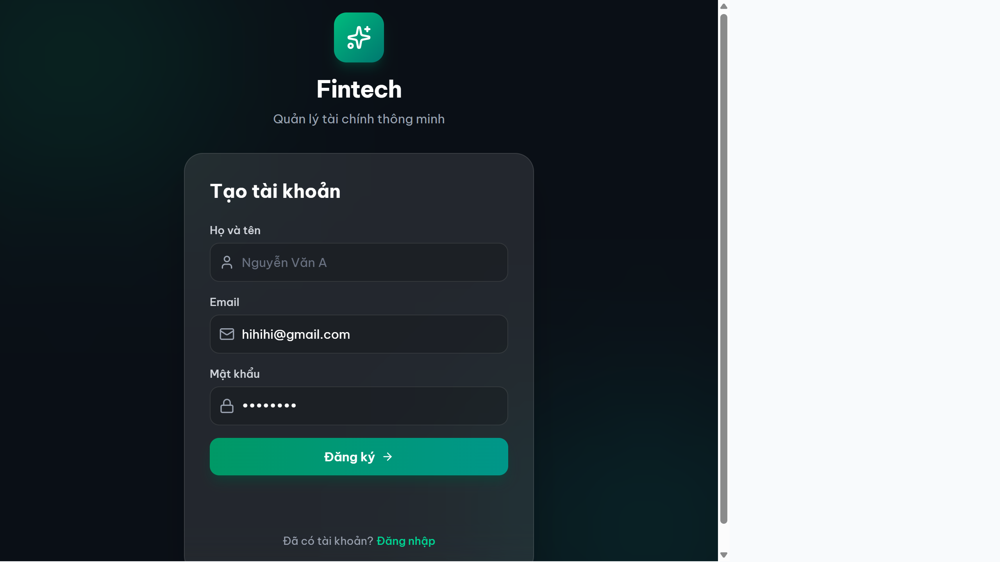                   |
| 2   | Đăng nhập và quản lý phiên làm việc             | Người dùng nhập email và mật khẩu, nhấn**Đăng nhập**. Hệ thống xác minh thông tin và cấp hai mã bảo mật: mã truy cập ngắn hạn (hết hạn sau 40 phút) và mã làm mới dài hạn (7 ngày). Khi mã truy cập hết hạn, ứng dụng tự động lấy mã mới mà không làm gián đoạn trải nghiệm người dùng. Nếu đăng nhập sai mật khẩu nhiều lần liên tiếp, hệ thống tạm thời khóa để bảo vệ tài khoản. | Hoàn thành 100% | 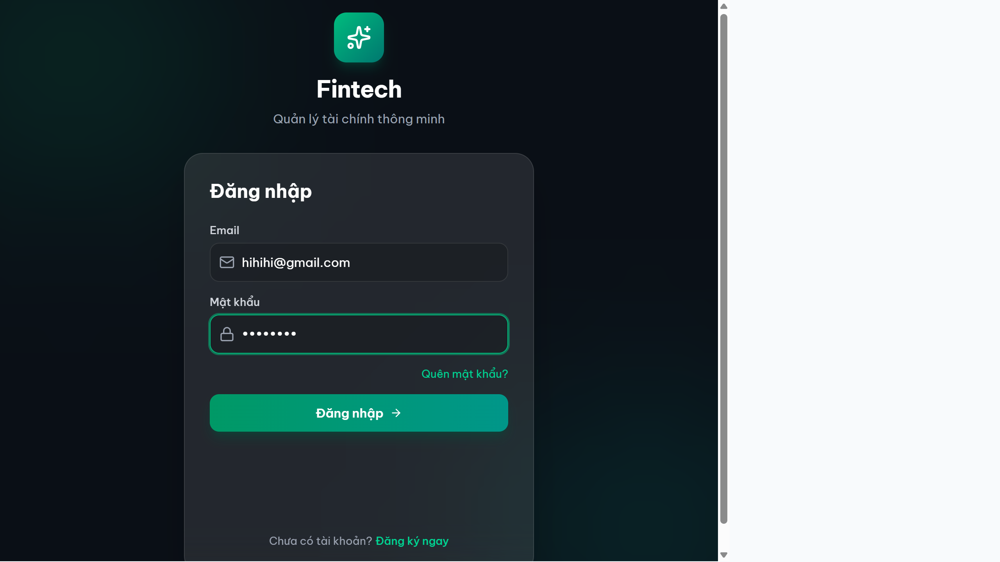                    |
| 3   | Quản lý hồ sơ người dùng                          | Sau khi đăng nhập, người dùng vào trang**Cài đặt** để cập nhật họ tên, ảnh đại diện và các tùy chọn cá nhân như ngôn ngữ hiển thị, đơn vị tiền tệ, giao diện sáng/tối. Thông tin cá nhân được lấy trực tiếp từ mã xác thực nên luôn chính xác và không cần tải lại trang.                                                                                                                            | Hoàn thành 100% | 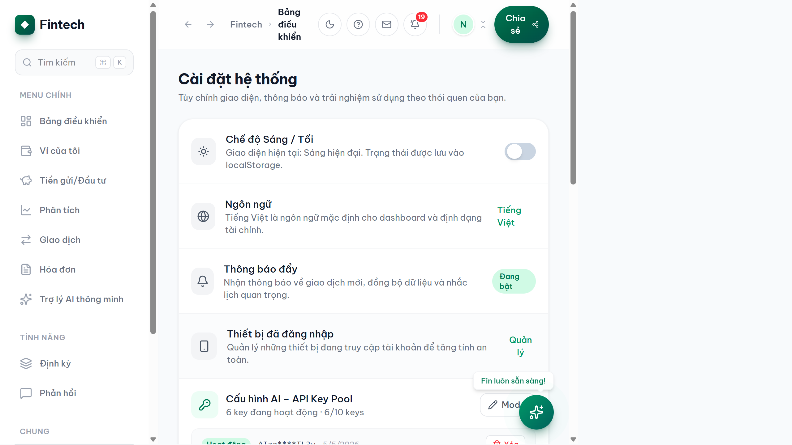           |
| 4   | Quản lý ví tiền                                      | Người dùng có thể tạo nhiều ví khác nhau (tiền mặt, ngân hàng, ví điện tử như MoMo, ZaloPay…) với số dư ban đầu tùy chọn. Mỗi lần ghi nhận giao dịch, số dư ví được cập nhật tự động — thu vào thì tăng, chi ra thì giảm. Người dùng cũng có thể khóa hoặc xóa ví khi không còn sử dụng.                                                                                                                   | Hoàn thành 100% | 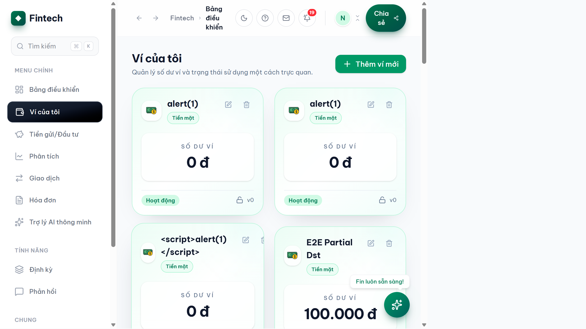                           |
| 5   | Ghi nhận giao dịch thu/chi                             | Người dùng chọn ví, nhập số tiền, chọn danh mục (Ăn uống, Đi lại, Lương…) và ngày thực hiện rồi lưu. Hệ thống tự động cập nhật số dư ví ngay sau đó. Để tránh ghi trùng khi người dùng nhấn nút nhiều lần, mỗi giao dịch được đánh dấu định danh duy nhất — lần thứ hai gửi cùng yêu cầu sẽ bị từ chối tự động.                                                                                  | Hoàn thành 100% | 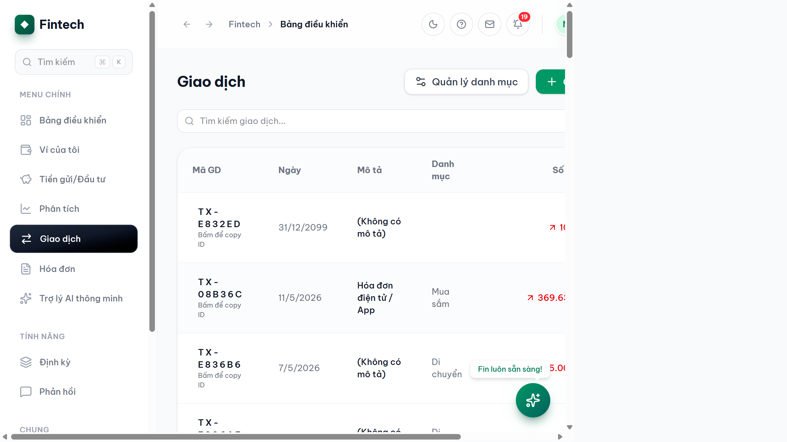               |
| 6   | Quản lý danh mục chi tiêu                            | Hệ thống cung cấp sẵn các danh mục phổ biến (Ăn uống, Đi lại, Giải trí, Lương, Thưởng…). Người dùng có thể thêm danh mục riêng phù hợp với nhu cầu cá nhân, hoặc chỉnh sửa, vô hiệu hóa danh mục không dùng nữa.                                                                                                                                                                                                             | Hoàn thành 100% |  |
| 7   | Scan và xử lý hóa đơn tự động                   | Người dùng chụp hoặc tải ảnh hóa đơn/biên lai lên ứng dụng. Hệ thống dùng công nghệ nhận dạng hình ảnh (AI) để tự động đọc tên cửa hàng, tổng tiền và ngày giao dịch. Sau khi xem lại và chỉnh sửa nếu cần, người dùng xác nhận để tạo giao dịch — không cần gõ tay thủ công.                                                                                                                                | Hoàn thành 100% | 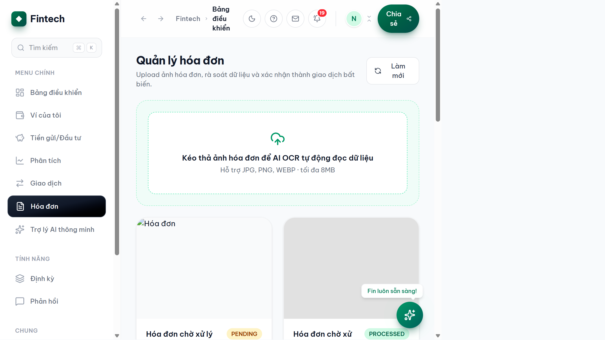                   |
| 8   | Giao dịch định kỳ tự động                         | Người dùng cài đặt các khoản thu/chi lặp lại như tiền thuê nhà hàng tháng, phí đăng ký dịch vụ hàng tháng… Hệ thống ghi nhớ lịch và nhắc nhở hoặc tự động tạo giao dịch đúng kỳ. Người dùng có thể tạm dừng hoặc xóa quy tắc bất cứ lúc nào.                                                                                                                                                                     | Hoàn thành 100% | 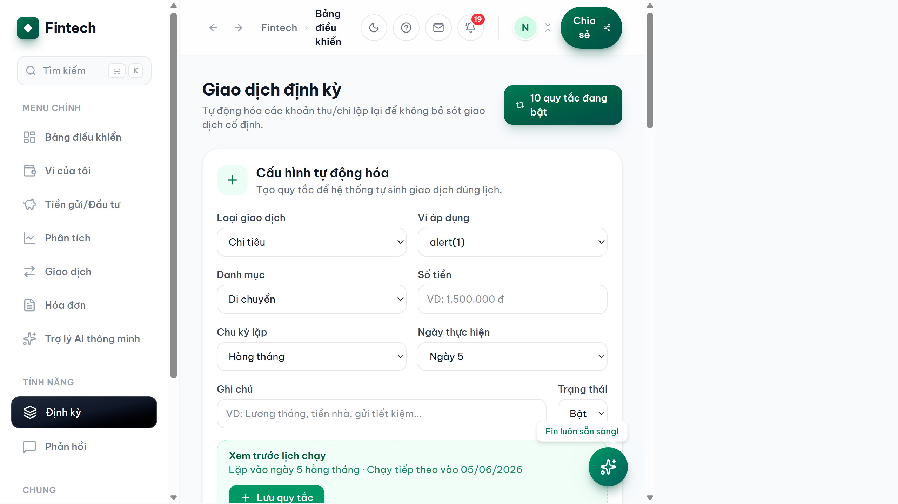       |
| 9   | Quản lý mục tiêu tiết kiệm và đầu tư           | Người dùng tạo mục tiêu tiết kiệm (ví dụ: "Mua xe — 50 triệu") hoặc theo dõi danh mục đầu tư. Mỗi lần nạp tiền vào mục tiêu, số dư ví tương ứng giảm đi. Khi đạt mục tiêu hoặc muốn rút, người dùng thực hiện tất toán và tiền được chuyển về ví đã chọn.                                                                                                                                                     | Hoàn thành 100% | 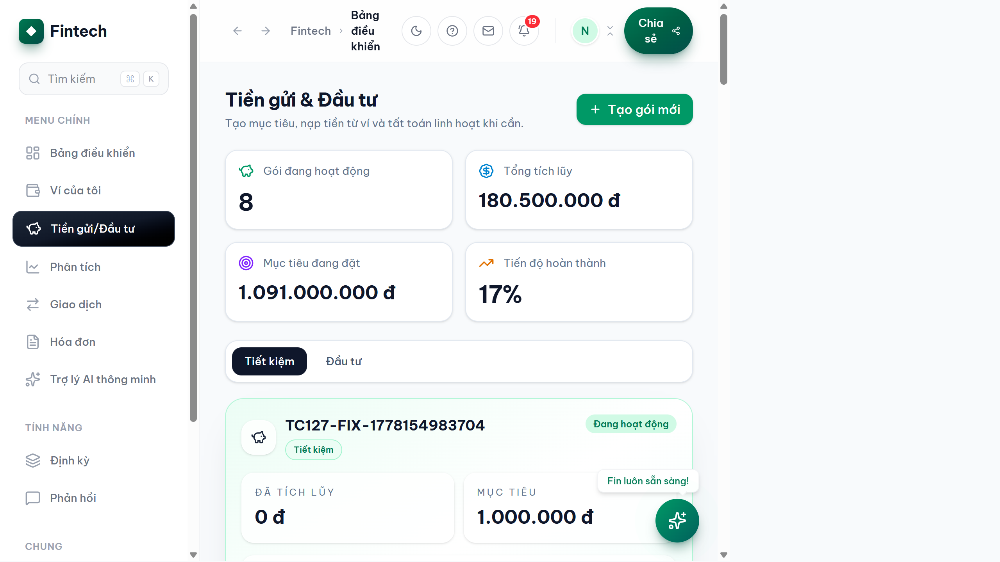       |
| 10  | Bảng phân tích tài chính theo kỳ                   | Sau khi đăng nhập, người dùng xem ngay**Bảng điều khiển** với tổng thu, tổng chi, số dư ròng và biểu đồ theo từng tháng hoặc khoảng thời gian tùy chọn. Có thể lọc theo từng ví hoặc xem tổng hợp tất cả. Dữ liệu được cập nhật theo thời gian thực sau mỗi giao dịch.                                                                                                                                            | Hoàn thành 100% | 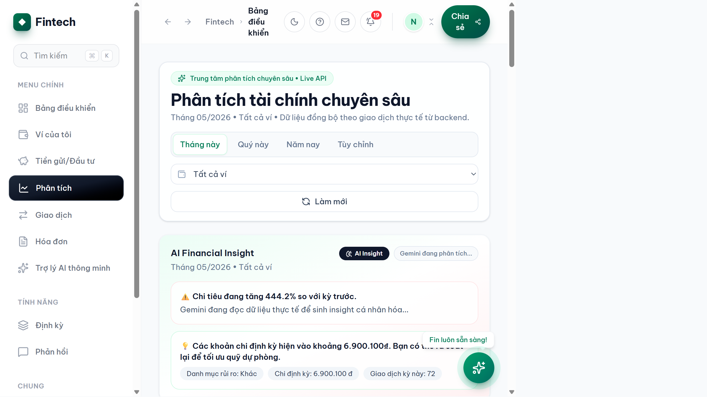                  |
| 11  | Hệ thống thông báo trong ứng dụng                  | Mỗi khi có biến động tài chính (giao dịch thành công, mục tiêu tiết kiệm đạt ngưỡng…), hệ thống tự động gửi thông báo vào chuông thông báo phía trên màn hình. Người dùng nhấn vào để xem chi tiết và đánh dấu đã đọc. Kết nối thời gian thực nên thông báo hiện ngay mà không cần tải lại trang.                                                                                                       | Hoàn thành 100% | 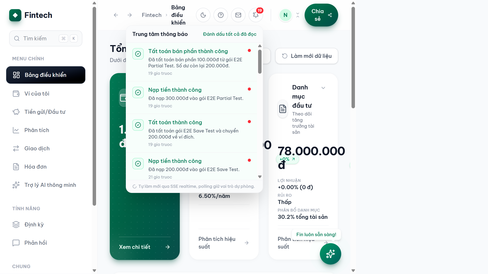             |
| 12  | Nhập liệu giao dịch bằng ngôn ngữ tự nhiên (NLP) | Người dùng dán đoạn tin nhắn hoặc gõ một câu thông thường như*"Sáng ăn phở 40k, chiều gửi xe 10k"* vào ô nhập liệu rồi nhấn **Phân tích bằng AI**. Hệ thống tự động tách thành từng giao dịch riêng với số tiền và danh mục phù hợp để người dùng xem lại và xác nhận trước khi lưu — không cần nhập tay từng mục một.                                                                         | Hoàn thành 100% | 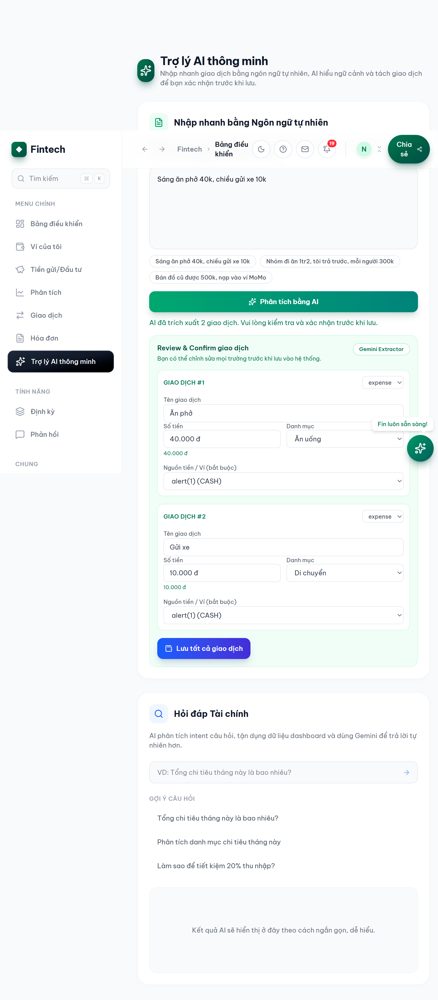          |
| 13  | Trợ lý AI — hỏi đáp tài chính cá nhân          | Người dùng nhập câu hỏi bằng tiếng Việt như*"Tháng này tôi chi bao nhiêu cho ăn uống?"* hoặc *"Tháng 3 tôi tiết kiệm được chưa?"*. AI phân tích dữ liệu thu/chi thực tế của người dùng để trả lời chính xác và có ngữ cảnh.                                                                                                                                                                                            | Hoàn thành 100% | 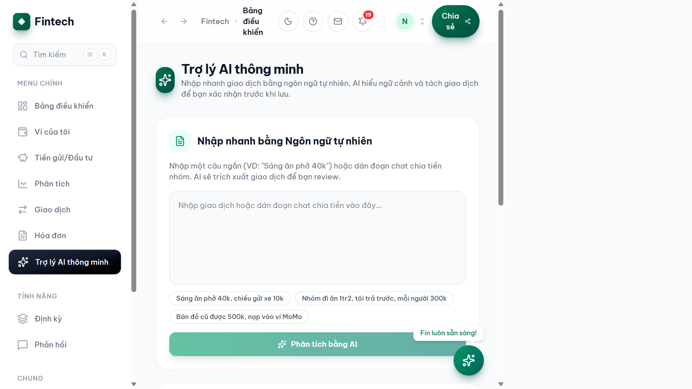                              |
| 14  | Tư vấn tài chính thông minh (AI Advisor)            | Ngoài hỏi đáp dữ liệu cá nhân, người dùng có thể hỏi các câu chung về tài chính như*"Lãi suất tiết kiệm hiện tại là bao nhiêu?"* hoặc *"Nên đầu tư vàng hay gửi ngân hàng?"*. Hệ thống kết hợp kiến thức tài chính và thông tin thị trường mới nhất để đưa ra tư vấn phù hợp.                                                                                                                           | Hoàn thành 100% |                      |
| 15  | Lưu trữ ảnh và tài liệu đính kèm                | Khi người dùng upload ảnh hóa đơn hoặc ảnh đại diện, tệp được lưu trữ an toàn trên dịch vụ đám mây (Cloudinary) và trả về đường dẫn URL để hiển thị. Hệ thống cũng cho phép xóa ảnh không còn cần thiết để tiết kiệm bộ nhớ.                                                                                                                                                                                        | Hoàn thành 100% | 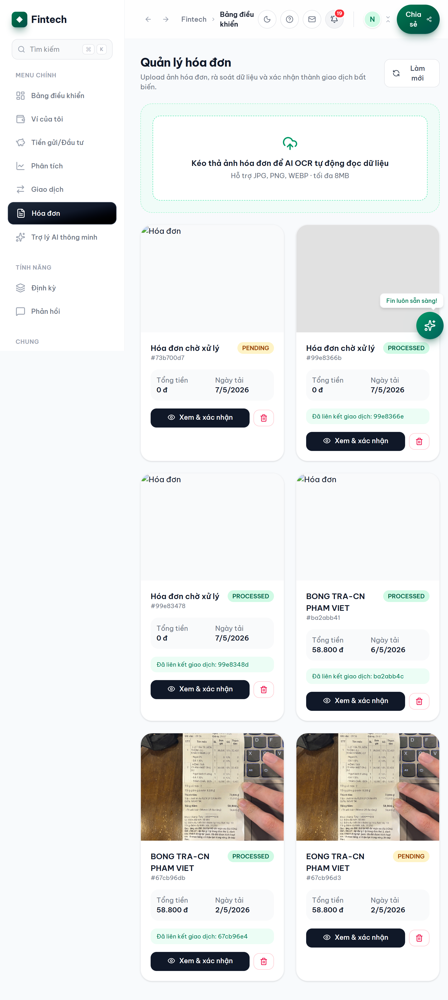                |
| 16  | Cài đặt bảo mật và khóa xác thực AI             | Người dùng vào**Cài đặt** để bật xác thực hai lớp (2FA) nhằm tăng cường bảo mật tài khoản. Ngoài ra, người dùng có thể thêm khóa API Gemini cá nhân để sử dụng tính năng AI mà không bị giới hạn theo quota chung của hệ thống. Khóa API được mã hóa trước khi lưu, không ai kể cả quản trị viên có thể đọc được nội dung gốc.                                                               | Hoàn thành 100% |                     |
| 17  | Bảo mật dữ liệu và phân quyền truy cập           | Toàn bộ kết nối giữa ứng dụng và máy chủ đều đi qua cổng bảo mật duy nhất. Mỗi người dùng chỉ xem được dữ liệu của chính mình — không ai có thể xem ví, giao dịch hay thông báo của người khác. Hệ thống tự động từ chối các yêu cầu không hợp lệ (token giả, tấn công đoán mật khẩu, dữ liệu độc hại trong tên ví…).                                                                             | Hoàn thành 100% | 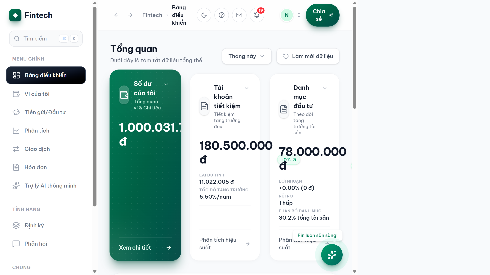             |

---

## Tổng hợp mức độ hoàn thành

| Hạng mục              | Số yêu cầu | Hoàn thành           | Ghi chú                                                        |
| ----------------------- | ------------- | ---------------------- | --------------------------------------------------------------- |
| Xác thực & Bảo mật  | 3             | 3/3 (100%)             | Bao gồm đăng ký, đăng nhập, phân quyền                 |
| Quản lý tài chính   | 6             | 6/6 (100%)             | Ví, giao dịch, danh mục, tiết kiệm, định kỳ, hóa đơn |
| Phân tích & Báo cáo | 1             | 1/1 (100%)             | Dashboard theo kỳ, lọc theo ví                               |
| Tính năng AI          | 3             | 3/3 (100%)             | NLP nhập liệu, Chat hỏi đáp, Tư vấn tài chính          |
| Tiện ích hỗ trợ     | 4             | 4/4 (100%)             | Thông báo, hồ sơ, cài đặt, lưu trữ đám mây          |
| **Tổng cộng**   | **17**  | **17/17 (100%)** |                                                                 |

---

*Minh chứng chụp màn hình thực tế từ hệ thống đang chạy tại `http://localhost:5173` — tài khoản `hihihi@gmail.com` — ngày 08/05/2026.*
