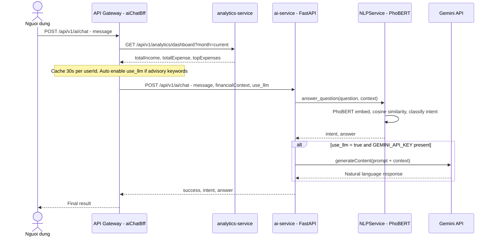
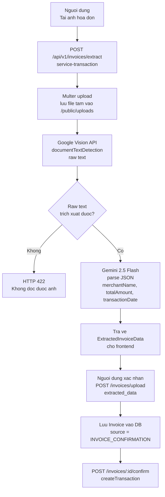

# BÁO CÁO PHÂN TÍCH HỆ THỐNG

## Dự án: Fintech – Ứng dụng quản lý tài chính cá nhân tích hợp AI

> **Vai trò phân tích:** Tech Lead / System Analyst
> **Ngày lập:** 21/04/2026
> **Phạm vi:** Toàn bộ mã nguồn backend và frontend của dự án

---

## 1. Hệ thống giải quyết bài toán gì?

Ứng dụng giúp người dùng kiểm soát tài chính cá nhân tại một nơi duy nhất thay vì phải tra cứu thủ công trên từng tài khoản ngân hàng, ví MoMo hay ZaloPay riêng lẻ.

Ba vấn đề thực tế được giải quyết:

1. **Tiền nằm ở nhiều chỗ, khó theo dõi**: Người dùng có thể tạo ví cho từng nguồn tiền (thẻ ngân hàng, MoMo, ZaloPay, tiền mặt) và xem số dư tổng hợp trên một màn hình.`[Nguồn: be/service-wallet/src/models/Wallet.ts]`
2. **Ghi hóa đơn mất thời gian**: Thay vì nhập tay từng khoản, người dùng chỉ cần chụp ảnh hóa đơn. Hệ thống tự đọc tên cửa hàng, số tiền và ngày giao dịch rồi hỏi xác nhận trước khi lưu.`[Nguồn: be/service-transaction/src/services/invoice-extraction.service.ts]`
3. **Không biết mình chi tiêu ra sao**: Ứng dụng tổng hợp thu/chi theo tháng, theo danh mục và cho phép hỏi bằng tiếng Việt thông thường, ví dụ "Tháng này tôi chi ăn uống bao nhiêu?" để nhận câu trả lời ngay.
   `[Nguồn: be/analytics-service/src/models/monthlyAggregate.model.ts]`
   `[Nguồn: be/ai-service/app/api/endpoints/ai.py]`

---

## 2. Đối tượng người dùng là ai?

Ứng dụng phục vụ **một nhóm người dùng duy nhất**: cá nhân đã đăng ký tài khoản. Không có vai trò quản trị viên hay phân cấp quyền hạn nào trong hệ thống hiện tại.

Mỗi tài khoản chỉ lưu thông tin cơ bản: email, họ tên, số điện thoại và trạng thái hoạt động — không có trường phân loại vai trò.
`[Nguồn: be/service-identity/src/models/User.ts]`

Sau khi đăng nhập, mọi thao tác đều yêu cầu token xác thực hợp lệ. Dữ liệu của người dùng nào thì chỉ người đó mới xem và chỉnh sửa được — kể cả ví, giao dịch lẫn thông báo.
`[Nguồn: be/api-gateway/middlewares/verifyToken.ts]`

Mỗi tài khoản có phần cài đặt riêng: ngôn ngữ hiển thị (mặc định tiếng Việt), đơn vị tiền tệ (VND), giao diện sáng/tối và trạng thái xác thực 2 bước.
`[Nguồn: be/service-identity/src/models/UserSettings.ts]`

Hiện chưa có giao diện quản trị hay công cụ dành cho vận hành hệ thống từ phía nhà phát triển.

---

## 3. Các chức năng chính là gì?

### 3.1 Đăng ký, đăng nhập và bảo mật tài khoản

Người dùng tạo tài khoản bằng email và mật khẩu. Có thể bật thêm xác thực 2 bước qua ứng dụng như Google Authenticator để tăng bảo mật. Phiên đăng nhập tự hết hạn sau 15 phút không hoạt động; ứng dụng tự gia hạn ngầm trong vòng 7 ngày mà không cần đăng nhập lại.
`[Nguồn: be/service-identity/routes/index.ts]`
`[Nguồn: be/service-identity/utils/jwt.ts]`
`[Nguồn: be/service-identity/utils/totp.ts]`

### 3.2 Quản lý nhiều ví

Người dùng tạo ví cho từng nguồn tiền: thẻ ngân hàng, MoMo, ZaloPay hoặc tiền mặt. Mỗi ví có tên riêng, số dư ban đầu và có thể tạm khóa khi không dùng. Số dư ví tự động cập nhật mỗi khi có giao dịch được ghi nhận.
`[Nguồn: be/service-wallet/src/models/Wallet.ts]`
`[Nguồn: be/service-wallet/src/routes/index.ts]`

### 3.3 Ghi nhận thu/chi

Người dùng tạo giao dịch thu hoặc chi, chọn ví thanh toán, gán danh mục và thêm mô tả. Hệ thống ngăn việc ghi trùng giao dịch ngay cả khi ứng dụng gửi yêu cầu nhiều lần do lỗi mạng. Số dư ví được cập nhật tự động sau khi giao dịch được xác nhận thành công.
`[Nguồn: be/service-transaction/src/models/transaction.model.ts]`
`[Nguồn: be/service-wallet/src/messaging/wallet.consumer.ts]`

### 3.4 Danh mục chi tiêu cá nhân

Người dùng tự tạo và đặt tên danh mục theo nhu cầu (ăn uống, đi lại, học tập, v.v.). Danh mục dùng để phân loại giao dịch và làm căn cứ cho biểu đồ phân tích sau này.
`[Nguồn: be/service-transaction/src/controllers/category.controller.ts]`

### 3.5 Chụp và nhập hóa đơn tự động

Người dùng chụp ảnh hóa đơn giấy, hệ thống đọc và điền sẵn tên cửa hàng, tổng tiền, ngày mua. Người dùng xem lại, chỉnh nếu cần rồi bấm xác nhận — giao dịch được tạo và lưu ngay, không cần nhập tay.
`[Nguồn: be/service-transaction/src/controllers/invoice.controller.ts]`
`[Nguồn: be/service-transaction/src/services/invoice-extraction.service.ts]`

### 3.6 Giao dịch tự động định kỳ

Người dùng thiết lập các khoản thu/chi lặp lại theo tuần hoặc theo tháng, ví dụ tiền thuê nhà ngày 1 hàng tháng hoặc tiền cà phê mỗi thứ Hai. Hệ thống tự tạo giao dịch đúng ngày mà không cần nhắc nhở.
`[Nguồn: be/service-transaction/src/jobs/recurring-transactions.job.ts]`
`[Nguồn: be/service-transaction/src/models/recurring-rule.model.ts]`

### 3.7 Theo dõi mục tiêu tiết kiệm và đầu tư

Người dùng đặt mục tiêu tiết kiệm hoặc đầu tư với tên, số tiền cần đạt và thời hạn. Có thể nạp tiền vào từng đợt và theo dõi tiến độ. Khi đạt mục tiêu, người dùng tất toán để kết thúc.
`[Nguồn: be/service-transaction/src/models/saving.model.ts]`
`[Nguồn: be/service-transaction/src/controllers/saving.controller.ts]`

### 3.8 Báo cáo và phân tích tài chính

Ứng dụng hiển thị tổng thu, tổng chi và số dư ròng theo tháng, quý, năm hoặc khoảng thời gian tuỳ chọn. Biểu đồ phân tích theo danh mục và theo từng ví giúp người dùng thấy rõ tiền đi về đâu.
`[Nguồn: be/analytics-service/src/services/analytics.service.ts]`
`[Nguồn: be/analytics-service/src/models/monthlyAggregate.model.ts]`

### 3.9 Thông báo biến động số dư

Mỗi khi có giao dịch làm thay đổi số dư ví, ứng dụng gửi thông báo ngay lập tức đến người dùng mà không cần tải lại trang. Người dùng xem lịch sử thông báo và đánh dấu đã đọc.
`[Nguồn: be/notification-service/src/messaging/notification.consumer.ts]`
`[Nguồn: be/notification-service/src/routes/index.ts]`

---

## 4. Nhóm đã tích hợp AI/NLP ở đâu?

Hệ thống có **hai tính năng AI** phục vụ hai nhu cầu khác nhau:

### 4.1 Tính năng đọc hóa đơn tự động

Khi người dùng chụp ảnh hóa đơn và gửi lên, hệ thống xử lý theo hai bước:

- **Bước 1 – Đọc chữ từ ảnh**: Google Vision API quét toàn bộ văn bản có trong ảnh hóa đơn, kể cả chữ nhỏ hay nghiêng.
- **Bước 2 – Hiểu và lấy thông tin cần thiết**: Gemini 2.5 Flash đọc đoạn văn bản thô vừa trích xuất, xác định đâu là tên cửa hàng, đâu là tổng tiền, đâu là ngày giao dịch, rồi trả về dưới dạng dữ liệu có cấu trúc để điền vào form.

Nếu ảnh quá mờ hoặc không đọc được, hệ thống báo lỗi ngay thay vì điền sai thông tin.`[Nguồn: be/service-transaction/src/services/invoice-extraction.service.ts]`

> **Lưu ý lịch sử**: Phiên bản trước xử lý OCR trong module Python riêng. Toàn bộ chức năng này đã chuyển sang module Node.js để tích hợp trực tiếp vào luồng quản lý hóa đơn, giảm độ trễ và đơn giản hoá vận hành.
> `[Nguồn: be/ai-service/app/services/ocr_service.py]`

### 4.2 Tính năng trợ lý tài chính AI (chatbot)

Người dùng gõ câu hỏi bằng tiếng Việt bình thường, ví dụ "Tháng này tôi tiêu nhiều nhất vào khoản gì?" hoặc "Tôi có nên cắt giảm chi tiêu không?". Hệ thống xử lý qua ba bước nối tiếp:

**Bước 1 – Lấy dữ liệu tài chính thực của người dùng**:
Trước khi hỏi AI bất cứ điều gì, hệ thống tự động lấy số liệu tháng hiện tại của người dùng từ module phân tích: tổng thu, tổng chi, top 3 danh mục chi tiêu lớn nhất. Dữ liệu này được dùng làm ngữ cảnh để AI trả lời đúng với thực tế tài chính của từng người, không phải câu trả lời chung chung.
`[Nguồn: be/api-gateway/utils/aiChatBff.ts]`

**Bước 2 – Hiểu ý định câu hỏi**:
Mô hình ngôn ngữ PhoBERT (được huấn luyện đặc biệt cho tiếng Việt) phân tích câu hỏi và phân loại người dùng đang hỏi về chi tiêu, thu nhập hay muốn xin lời khuyên. Từ đó hệ thống chọn cách trả lời phù hợp dựa trên số liệu thực đã có.
`[Nguồn: be/ai-service/app/services/nlp_service.py]`

**Bước 3 – Sinh câu trả lời tự nhiên (khi cần)**:
Với các câu hỏi mang tính tư vấn ("nên làm gì", "làm sao tiết kiệm hơn"), hệ thống gọi thêm Gemini để diễn đạt câu trả lời mạch lạc hơn. AI được yêu cầu chỉ dùng số liệu từ dữ liệu thực, không được bịa con số.
`[Nguồn: be/ai-service/app/services/gemini_service.py]`

### Sơ đồ luồng AI Chatbot

### Sơ đồ luồng OCR Hóa đơn

[📍 Ghi chú cho Dev: Chèn ảnh chụp màn hình giao diện trang Invoices (fe/src/pages/Invoices.tsx) khi upload ảnh hóa đơn thực tế và kết quả trích xuất tại đây để làm minh họa]

---

## 5. Điểm nổi bật của hệ thống

### 5.1 Mỗi tính năng chạy độc lập, không ảnh hưởng lẫn nhau

Hệ thống được chia thành 7 module riêng biệt, mỗi module lo một việc và có cơ sở dữ liệu riêng. Khi module thông báo gặp sự cố, người dùng vẫn ghi giao dịch bình thường. Khi module AI chậm, phần ví và báo cáo không bị ảnh hưởng.

| Module               | Vai trò                                                             |
| -------------------- | -------------------------------------------------------------------- |
| api-gateway          | Cổng vào duy nhất, kiểm tra đăng nhập, điều phối yêu cầu |
| service-identity     | Quản lý tài khoản, đăng nhập, xác thực 2 bước             |
| service-wallet       | Quản lý ví và số dư                                            |
| service-transaction  | Giao dịch, hóa đơn, định kỳ, tiết kiệm                      |
| analytics-service    | Tổng hợp và cung cấp báo cáo thu/chi                           |
| notification-service | Gửi thông báo biến động số dư                                |
| ai-service           | Chatbot tài chính tiếng Việt                                     |

`[Nguồn: be/docker-compose.yml]`
`[Nguồn: be/api-gateway/routes/index.ts]`

### 5.2 Số dư ví luôn đúng dù mạng không ổn định

Khi người dùng ghi một giao dịch, hệ thống không cập nhật số dư ngay mà lưu yêu cầu vào hàng chờ nội bộ trước. Một tiến trình nền kiểm tra hàng chờ mỗi 5 giây và xử lý từng cái. Cách này đảm bảo dù server bị ngắt đột ngột ở giữa chừng, số dư vẫn được cập nhật đúng khi khởi động lại, không bị thiếu hay cộng thừa.
`[Nguồn: be/service-transaction/src/messaging/outbox.publisher.ts]`
`[Nguồn: be/service-wallet/src/messaging/wallet.consumer.ts]`

### 5.3 Không thể ghi trùng giao dịch dù bấm nhiều lần

Mỗi giao dịch mang một mã định danh duy nhất. Nếu ứng dụng gửi cùng một yêu cầu hai lần (do mạng chậm, người dùng bấm nhanh tay), hệ thống nhận ra và chỉ xử lý một lần. Điều này cũng áp dụng cho giao dịch định kỳ — dù cron job chạy lại, tiền không bị trừ/cộng hai lần trong cùng một ngày.
`[Nguồn: be/service-transaction/src/models/transaction.model.ts]`
`[Nguồn: be/service-transaction/src/jobs/recurring-transactions.job.ts]`

### 5.4 Số dư không bị sai khi nhiều giao dịch xảy ra cùng lúc

Mỗi ví có một số phiên bản nội bộ. Khi hai giao dịch cùng cố cập nhật số dư ví tại một thời điểm, hệ thống chỉ cho phép cái đến trước thành công; cái đến sau tự thử lại. Cách này tránh tình huống số dư bị tính sai do xung đột đồng thời.
`[Nguồn: be/service-wallet/src/models/Wallet.ts]`
`[Nguồn: be/service-wallet/src/services/wallet.service.ts]`

### 5.5 Bảo mật tài khoản nhiều lớp

- Phiên đăng nhập được chia thành hai loại token: token truy cập ngắn hạn (15 phút) và token gia hạn dài hạn (7 ngày). Thiết kế này giới hạn thiệt hại nếu token bị lộ — kẻ tấn công chỉ có tối đa 15 phút để lạm dụng.
- Xác thực 2 bước bằng mã OTP thay đổi mỗi 30 giây, tương thích với Google Authenticator.
- Mật khẩu được mã hóa một chiều trước khi lưu, không thể giải mã ngược.
- Hệ thống giới hạn số lượng yêu cầu từ một địa chỉ IP trong một khoảng thời gian, ngăn tấn công dò mật khẩu hàng loạt.

`[Nguồn: be/service-identity/utils/jwt.ts]`
`[Nguồn: be/service-identity/utils/totp.ts]`
`[Nguồn: be/api-gateway/utils/redisClient.ts]`

### 5.6 Báo cáo tài chính phản hồi nhanh dù dữ liệu lớn

Thay vì tính toán lại tổng thu/chi từ toàn bộ lịch sử giao dịch mỗi khi người dùng mở màn hình báo cáo, hệ thống duy trì sẵn bảng tổng hợp theo tháng và cập nhật nó ngay khi có giao dịch mới. Khi người dùng xem dashboard, hệ thống chỉ đọc bảng tổng hợp này — thời gian phản hồi không phụ thuộc vào số lượng giao dịch tích lũy qua các tháng.
`[Nguồn: be/analytics-service/src/models/monthlyAggregate.model.ts]`
`[Nguồn: be/analytics-service/src/messaging/analytics.consumer.ts]`

### 5.7 Chatbot hoạt động ngay cả khi không có kết nối API trả phí

Tính năng chatbot được thiết kế có dự phòng: nếu không cấu hình Gemini API key, hệ thống vẫn trả lời được các câu hỏi tra cứu thông thường ("chi bao nhiêu", "thu bao nhiêu") bằng cách dùng mô hình PhoBERT chạy cục bộ kết hợp số liệu thực từ tài khoản. Gemini chỉ được gọi thêm khi câu hỏi cần tư vấn và khi API key có sẵn.
`[Nguồn: be/ai-service/app/services/gemini_service.py]`
`[Nguồn: be/ai-service/app/services/nlp_service.py]`

### 5.8 Những điểm còn hạn chế

- **Chưa có tài khoản quản trị**: Không có giao diện hay quyền hạn dành cho người vận hành hệ thống. Nếu sau này cần xem log toàn hệ thống hoặc hỗ trợ người dùng từ phía admin, phần này phải xây thêm từ đầu.
- **Khóa bảo mật đăng nhập chưa có cơ chế thay thế định kỳ**: Nếu khóa ký token bị lộ, tất cả phiên đăng nhập hiện tại đều có nguy cơ bị giả mạo cho đến khi token hết hạn tự nhiên. Hiện chưa có cách vô hiệu hóa hàng loạt ngay lập tức.
- **Dữ liệu ngữ cảnh cho AI được lưu tạm trong bộ nhớ tiến trình**: Khi server khởi động lại, toàn bộ cache này mất. Nếu sau này chạy nhiều instance gateway song song, mỗi instance có cache riêng và có thể trả kết quả khác nhau cho cùng một người dùng.`[Nguồn: be/api-gateway/utils/aiChatBff.ts]`
- **Lần dùng chatbot đầu tiên sau khi khởi động server có thể chậm**: Mô hình PhoBERT chỉ được tải vào bộ nhớ khi có yêu cầu đầu tiên (không tải sẵn khi khởi động để tiết kiệm RAM). Người dùng đầu tiên trong ngày sẽ chờ lâu hơn bình thường.
  `[Nguồn: be/ai-service/app/main.py]`

[📍 Ghi chú cho Dev: Chèn ảnh chụp màn hình Dashboard tổng quan (fe/src/pages/Dashboard.tsx) hiển thị đủ các ví, biểu đồ thu/chi tháng và thông báo real-time tại đây]

[📍 Ghi chú cho Dev: Chèn ảnh chụp màn hình trang SmartAI (fe/src/pages/SmartAIPage.tsx) khi đặt câu hỏi tài chính bằng tiếng Việt và nhận câu trả lời từ chatbot tại đây]

---

## 6. Bối cảnh và nhu cầu thực tế của người dùng

### 6.1 Tình trạng phổ biến hiện nay

Phần lớn người đi làm tại Việt Nam hiện nay sử dụng đồng thời nhiều phương tiện thanh toán: tài khoản ngân hàng để nhận lương và chuyển khoản, ví MoMo hoặc ZaloPay cho các giao dịch nhỏ hàng ngày, thẻ tín dụng cho mua sắm lớn, và tiền mặt dự phòng. Mỗi nguồn tiền có ứng dụng riêng, thông báo riêng, lịch sử riêng.

Kết quả là cuối tháng người dùng không biết chính xác mình đã tiêu bao nhiêu, tiêu vào đâu, và còn bao nhiêu tiền thực sự có thể dùng. Việc tổng hợp thủ công mất thời gian và dễ bỏ sót.

### 6.2 Nhu cầu cụ thể dẫn đến ứng dụng này

**Người dùng loại 1 – Nhân viên văn phòng trẻ (22–30 tuổi):**
Muốn biết mỗi tháng chi bao nhiêu cho ăn uống, đi lại, giải trí mà không phải cộng tay. Cần được nhắc khi số dư sắp cạn hoặc khi có khoản chi lớn bất thường. Hay chụp bill đồ uống, ăn nhanh nhưng ngại nhập tay.

**Người dùng loại 2 – Freelancer và người kinh doanh nhỏ (26–40 tuổi):**
Thu nhập không đều, có tháng nhiều dự án có tháng ít. Cần theo dõi dòng tiền theo tuần để biết thời điểm nào căng, thời điểm nào dư. Muốn hỏi nhanh "tuần này tôi thu được bao nhiêu" mà không phải mở bảng tính.

### 6.3 Điểm khó chịu người dùng gặp phải trước khi có ứng dụng

| Tình huống                           | Vấn đề                                              |
| -------------------------------------- | ------------------------------------------------------ |
| Xem số dư thực tế                  | Phải mở 3–4 ứng dụng, cộng tay                   |
| Biết tháng này chi gì nhiều nhất | Không có tổng hợp, phải đọc từng thông báo   |
| Lưu lại hóa đơn giấy             | Chụp ảnh lưu điện thoại, không tra cứu được |
| Đặt mục tiêu tiết kiệm           | Dùng ghi chú hoặc bảng tính, dễ quên            |
| Hỏi nhanh về tình hình tài chính | Không có công cụ, phải tự tính                  |

---

## 7. Mục tiêu chức năng

Ứng dụng đặt ra các mục tiêu chức năng sau, tất cả đều đã được triển khai trong mã nguồn hiện tại:

### 7.1 Tổng hợp tài chính về một nơi

Người dùng tạo và quản lý tất cả nguồn tiền trong một ứng dụng. Số dư tổng hợp được hiển thị trên màn hình chính mà không cần chuyển qua lại giữa các ứng dụng khác.
`[Nguồn: be/service-wallet/src/models/Wallet.ts]`
`[Nguồn: fe/src/pages/Wallets.tsx]`

### 7.2 Ghi nhận thu/chi nhanh và chính xác

Người dùng tạo giao dịch trong vài thao tác: chọn ví, chọn danh mục, nhập số tiền. Số dư cập nhật ngay. Không bao giờ ghi trùng dù bấm nhiều lần hay mạng yếu.
`[Nguồn: be/service-transaction/src/models/transaction.model.ts]`
`[Nguồn: fe/src/pages/Transactions.tsx]`

### 7.3 Tự động hóa các khoản chi lặp lại

Người dùng thiết lập một lần cho các khoản cố định hàng tuần hoặc hàng tháng. Ứng dụng tự ghi giao dịch đúng ngày, không cần nhắc nhở.
`[Nguồn: be/service-transaction/src/jobs/recurring-transactions.job.ts]`
`[Nguồn: fe/src/pages/Recurring.tsx]`

### 7.4 Theo dõi mục tiêu tiết kiệm

Người dùng đặt mục tiêu với tên, số tiền cần đạt và thời hạn. Có thể nạp tiền từng đợt và theo dõi tiến độ trực quan.
`[Nguồn: be/service-transaction/src/models/saving.model.ts]`
`[Nguồn: fe/src/pages/SavingInvestment.tsx]`

### 7.5 Báo cáo thu/chi rõ ràng theo thời gian

Người dùng xem tổng thu, tổng chi và số dư ròng theo tháng, quý hoặc năm. Biểu đồ phân tích theo danh mục và theo ví giúp nhận ra ngay nhóm chi tiêu nào đang chiếm tỷ trọng lớn.
`[Nguồn: be/analytics-service/src/services/analytics.service.ts]`
`[Nguồn: fe/src/pages/Analytics.tsx]`

### 7.6 Thông báo biến động tức thì

Mỗi khi có giao dịch thay đổi số dư ví, người dùng nhận thông báo ngay trong ứng dụng mà không cần tải lại trang.
`[Nguồn: be/notification-service/src/messaging/notification.consumer.ts]`
`[Nguồn: fe/src/components/layout/NotificationBell.tsx]`

---

## 8. Mục tiêu AI/NLP

Ứng dụng tích hợp AI với hai mục tiêu riêng biệt, giải quyết hai điểm khó chịu khác nhau của người dùng:

### 8.1 Bỏ bước nhập tay hóa đơn

**Mục tiêu:** Người dùng chỉ cần chụp ảnh hóa đơn — ứng dụng tự đọc và điền thông tin, không cần gõ tay.

**Cách thực hiện:** Google Vision đọc toàn bộ văn bản từ ảnh hóa đơn (kể cả chữ nhỏ, nghiêng, hoặc mờ nhẹ). Gemini 2.5 Flash đọc văn bản thô đó và xác định: đây là hóa đơn của cửa hàng nào, tổng tiền là bao nhiêu, ngày nào. Kết quả được điền sẵn vào form để người dùng xem lại trước khi lưu.

**Giới hạn thực tế:** Ảnh quá mờ, bị che khuất nhiều hoặc không có văn bản rõ ràng sẽ không trích xuất được và hệ thống thông báo lỗi ngay thay vì điền sai.
`[Nguồn: be/service-transaction/src/services/invoice-extraction.service.ts]`

[📍 Ghi chú cho Dev: Chèn ảnh chụp màn hình luồng nhập hóa đơn từ ảnh — bước upload, kết quả trích xuất điền sẵn và bước xác nhận tại đây]

### 8.2 Trả lời câu hỏi tài chính bằng tiếng Việt

**Mục tiêu:** Người dùng hỏi bằng ngôn ngữ tự nhiên ("Tháng này tôi chi nhiều nhất vào khoản gì?", "Tôi có đang tiêu quá nhiều không?") và nhận câu trả lời dựa trên dữ liệu thực của chính họ.

**Cách thực hiện theo hai loại câu hỏi:**

- **Câu hỏi tra cứu** ("chi bao nhiêu", "thu bao nhiêu"): Mô hình PhoBERT — được huấn luyện trên tiếng Việt — nhận dạng ý định câu hỏi. Ứng dụng lấy số liệu tháng hiện tại của người dùng (tổng thu, tổng chi, top danh mục) từ module phân tích rồi ghép thành câu trả lời. Hoạt động mà không cần API bên ngoài.
- **Câu hỏi tư vấn** ("nên làm gì", "làm sao tiết kiệm hơn"): Ngoài việc lấy số liệu, ứng dụng gọi thêm Gemini để diễn đạt lời khuyên mạch lạc hơn. AI chỉ được dùng số liệu thực của người dùng, không được tự bịa con số.

**Điểm quan trọng về độ tin cậy:** Câu trả lời luôn dựa trên dữ liệu thực từ tài khoản, không phải nhận định chung. Nếu người dùng chưa có dữ liệu tháng đó, ứng dụng nói rõ là chưa có thay vì đoán mò.
`[Nguồn: be/ai-service/app/services/nlp_service.py]`
`[Nguồn: be/ai-service/app/services/gemini_service.py]`
`[Nguồn: be/api-gateway/utils/aiChatBff.ts]`

[📍 Ghi chú cho Dev: Chèn ảnh chụp màn hình chatbot khi trả lời câu hỏi tra cứu và câu hỏi tư vấn thực tế tại đây]

---

## 9. Phạm vi của hệ thống

### 9.1 Trong phạm vi — những gì hệ thống đã xây dựng

| Nhóm tính năng       | Chi tiết                                                                         |
| ----------------------- | --------------------------------------------------------------------------------- |
| Quản lý tài khoản   | Đăng ký, đăng nhập, xác thực 2 bước, cài đặt cá nhân               |
| Quản lý ví           | Tạo/sửa/khóa ví cho thẻ ngân hàng, MoMo, ZaloPay, tiền mặt               |
| Giao dịch              | Ghi thu/chi thủ công, quản lý danh mục cá nhân                             |
| Hóa đơn thông minh  | Chụp ảnh → OCR → điền form tự động → xác nhận tạo giao dịch         |
| Giao dịch định kỳ   | Thiết lập thu/chi lặp lại theo tuần hoặc tháng                             |
| Tiết kiệm & đầu tư | Đặt mục tiêu, nạp tiền từng đợt, theo dõi tiến độ, tất toán        |
| Báo cáo tài chính   | Tổng hợp theo tháng/quý/năm/khoảng tuỳ chọn, biểu đồ danh mục và ví |
| Thông báo             | Thông báo biến động số dư ngay khi có giao dịch                          |
| Chatbot AI              | Hỏi đáp tài chính tiếng Việt dựa trên dữ liệu thực của người dùng |

### 9.2 Ngoài phạm vi — những gì hệ thống chưa xây dựng

| Tính năng                                           | Lý do chưa có / Ghi chú                                                         |
| ----------------------------------------------------- | ----------------------------------------------------------------------------------- |
| Kết nối trực tiếp với ngân hàng (Open Banking) | Yêu cầu hợp đồng API với từng ngân hàng, nằm ngoài phạm vi dự án này |
| Ứng dụng di động (iOS/Android)                    | Thư mục `fe-mobile/` tồn tại trong dự án nhưng hiện rỗng, chưa có code |
| Tài khoản quản trị hệ thống                     | Không có giao diện hay phân quyền cho admin, toàn bộ là end-user            |
| Chia sẻ ví hoặc chi tiêu nhóm                    | Mỗi ví gắn với một `userId` duy nhất, không hỗ trợ đồng sở hữu       |
| Xuất báo cáo ra file (PDF/Excel)                   | Chưa có tính năng xuất, chỉ xem trên giao diện web                          |
| Tích hợp thanh toán thực (nạp/rút tiền)        | Ứng dụng theo dõi và ghi nhận, không thực hiện giao dịch tài chính thật |
| Thông báo qua email hoặc SMS                       | Thông báo chỉ hiển thị trong ứng dụng web, không gửi ra ngoài             |
| Dự báo chi tiêu tương lai                        | Analytics hiện tại chỉ tổng hợp quá khứ, chưa có module dự báo           |

---

## CHƯƠNG 2: PHÂN TÍCH YÊU CẦU HỆ THỐNG

| STT | Yêu cầu bắt buộc | Mô tả cách nhóm thực hiện | Đã hoàn thành | Minh chứng |
|-----|---|---|---|---|
| 1 | **Đăng ký tài khoản** | Frontend gửi `POST /api/v1/auth/register` qua `axiosClient`. Backend (`authService.ts`) validate email/password, hash mật khẩu bằng `bcryptjs` (10 rounds), lưu vào MongoDB collection `users`. Đồng thời tạo bản ghi `UserSettings` với giá trị mặc định (locale: `vi-VN`, currency: `VND`). | Hoàn thành 100% | `be/service-identity/services/authService.ts` · `be/service-identity/src/models/User.ts` · `fe/src/pages/Auth.tsx` · `[📍 Chèn ảnh màn hình form đăng ký]` |
| 2 | **Đăng nhập và quản lý phiên** | `POST /api/v1/auth/login` kiểm tra email/password, ký 2 token riêng biệt: access token TTL 15 phút và refresh token TTL 7 ngày — cả hai đều chứa trường `type` để tránh dùng nhầm. Frontend lưu access token vào `localStorage`, tự gọi `POST /refresh` khi nhận 401. | Hoàn thành 100% | `be/service-identity/utils/jwt.ts` · `be/service-identity/routes/index.ts` · `fe/src/utils/axiosClient.ts` · `[📍 Chèn ảnh màn hình đăng nhập]` |
| 3 | **Xác thực 2 bước (2FA/TOTP)** | Người dùng bật 2FA qua `POST /api/v1/auth/2fa/setup` — backend dùng `otplib` sinh secret, trả về `otpauthUrl` để quét bằng Google Authenticator. Khi đăng nhập, nếu 2FA đang bật, backend trả `requires2FA: true` kèm `twoFactorToken` (TTL 5 phút). Client gọi tiếp `POST /login/2fa` với mã OTP 6 số. | Hoàn thành 100% | `be/service-identity/utils/totp.ts` · `be/service-identity/routes/index.ts` · `[📍 Chèn ảnh màn hình bật 2FA và quét QR]` |
| 4 | **Quản lý hồ sơ người dùng** | `GET /api/v1/auth/me` trả thông tin user hiện tại từ JWT payload. Frontend hiển thị form chỉnh sửa tên, avatar tại trang Profile. Phần cài đặt theme (sáng/tối) xử lý hoàn toàn phía client qua React Context, không persist lên server. | API hoàn thành. UI Profile có form nhưng chưa kết nối lưu thay đổi tên/avatar về backend. | `be/service-identity/routes/index.ts` · `fe/src/pages/Profile.tsx` · `fe/src/store/useAuthStore.ts` · `[📍 Chèn ảnh trang Profile]` |
| 5 | **Quản lý ví (CRUD)** | Toàn bộ CRUD đi qua `service-wallet` (port 3002). Controller `wallet.controller.ts` nhận request, gọi `walletService`, ghi vào MongoDB collection `wallets`. Mỗi ví có `userId`, `walletType` (CARD/MOMO/ZALOPAY/CASH), `balance` kiểu `Decimal128`, `status` (0/1/2) và `version` dùng cho optimistic locking. | Hoàn thành 100% | `be/service-wallet/src/controllers/wallet.controller.ts` · `be/service-wallet/src/models/Wallet.ts` · `fe/src/pages/Wallets.tsx` · `[📍 Chèn ảnh trang quản lý ví]` |
| 6 | **Cập nhật số dư ví tự động** | Khi giao dịch được tạo, `service-transaction` ghi event vào collection `outbox` (cùng MongoDB transaction). Background job `outbox.publisher.ts` poll mỗi 5 giây, publish event `TransactionCreated` lên RabbitMQ exchange `transaction.events`. `wallet.consumer.ts` subscribe, gọi `applyTransactionWithOptimisticLock` để cộng/trừ số dư — retry nếu `version` không khớp. | Hoàn thành 100% | `be/service-transaction/src/messaging/outbox.publisher.ts` · `be/service-wallet/src/messaging/wallet.consumer.ts` · `be/service-wallet/src/services/wallet.service.ts` · `[📍 Chèn ảnh số dư ví thay đổi sau khi tạo giao dịch]` |
| 7 | **Tạo và quản lý danh mục chi tiêu** | CRUD danh mục qua `category.controller.ts` trong `service-transaction`. Danh mục gắn `userId` — mỗi người có bộ danh mục riêng. Frontend có `CategoryManagerModal` cho phép tạo, đổi tên, xóa danh mục ngay từ trang Transactions. | Hoàn thành 100% | `be/service-transaction/src/controllers/category.controller.ts` · `fe/src/components/dashboard/CategoryManagerModal.tsx` · `[📍 Chèn ảnh modal quản lý danh mục]` |
| 8 | **Ghi nhận giao dịch thu/chi thủ công** | `POST /api/v1/transactions` nhận payload gồm `walletId`, `categoryId`, `amount`, `transaction_type` (INCOME/EXPENSE), `occurred_at`, `idempotency_key`. Service validate rồi lưu vào MongoDB. `idempotency_key` có unique index — gửi trùng request sẽ trả lỗi thay vì tạo giao dịch thứ hai. | Hoàn thành 100% | `be/service-transaction/src/controllers/transaction.controller.ts` · `be/service-transaction/src/models/transaction.model.ts` · `fe/src/components/dashboard/CreateTransactionModal.tsx` · `[📍 Chèn ảnh modal tạo giao dịch]` |
| 9 | **Lọc và tra cứu lịch sử giao dịch** | `GET /api/v1/transactions` nhận query params: `limit`, `offset`, `walletId`, `categoryId`, `status`, `dateFrom`, `dateTo`. Repository dùng MongoDB aggregation pipeline build điều kiện lọc động. Frontend có thanh filter kết hợp search text và dropdown. | Hoàn thành 100% | `be/service-transaction/src/repositories/transaction.repository.ts` · `fe/src/pages/Transactions.tsx` · `[📍 Chèn ảnh trang danh sách giao dịch với bộ lọc]` |
| 10 | **Nhập hóa đơn bằng OCR (AI)** | `POST /api/v1/invoices/extract` nhận file ảnh qua Multer, lưu tạm vào `public/uploads/`, gọi `InvoiceExtractionService`. Service gọi Google Cloud Vision `documentTextDetection` lấy raw text, sau đó gọi Gemini 2.5 Flash với prompt JSON-mode để parse ra `{ merchantName, totalAmount, transactionDate }`. File tạm bị xóa ngay sau khi xử lý. | Hoàn thành 100% | `be/service-transaction/src/services/invoice-extraction.service.ts` · `be/service-transaction/src/controllers/invoice.controller.ts` · `fe/src/pages/Invoices.tsx` · `[📍 Chèn ảnh luồng chụp hóa đơn và kết quả trích xuất]` |
| 11 | **Xác nhận và lưu hóa đơn** | Sau khi trích xuất, người dùng chỉnh sửa và gọi `POST /api/v1/invoices/upload` để lưu Invoice vào DB với `extracted_data`. Bước `POST /invoices/:id/confirm` tạo giao dịch chính thức với `source: INVOICE_CONFIRMATION` và kích hoạt luồng cập nhật số dư ví. | Hoàn thành 100% | `be/service-transaction/src/controllers/invoice.controller.ts` · `be/service-transaction/src/services/invoice.service.ts` · `[📍 Chèn ảnh bước xác nhận hóa đơn]` |
| 12 | **Giao dịch định kỳ (Recurring)** | CRUD recurring rules qua `recurring-rule.controller.ts`. Mỗi rule có `frequency` (WEEKLY/MONTHLY), `day_of_week` hoặc `day_of_month`, `status` (ACTIVE/PAUSED). Cron job `recurring-transactions.job.ts` chạy lúc 00:05 (Asia/Ho_Chi_Minh) bằng `node-cron`, quét tất cả rule ACTIVE, tạo giao dịch với idempotency key dạng `recurring:{ruleId}:{YYYY-MM-DD}`. | Hoàn thành 100% | `be/service-transaction/src/jobs/recurring-transactions.job.ts` · `be/service-transaction/src/models/recurring-rule.model.ts` · `fe/src/pages/Recurring.tsx` · `[📍 Chèn ảnh trang thiết lập giao dịch định kỳ]` |
| 13 | **Quản lý mục tiêu tiết kiệm & đầu tư** | CRUD savings qua `saving.controller.ts`. Mỗi saving có `type` (SAVING/INVESTMENT), `target_amount`, `current_amount`, `status` (ACTIVE/SETTLED). `POST /savings/:id/deposit` cộng vào `current_amount` và tạo giao dịch với `source: SAVING`. `POST /savings/:id/settle` chuyển trạng thái sang SETTLED. | Hoàn thành 100% | `be/service-transaction/src/controllers/saving.controller.ts` · `be/service-transaction/src/models/saving.model.ts` · `fe/src/pages/SavingInvestment.tsx` · `[📍 Chèn ảnh trang mục tiêu tiết kiệm]` |
| 14 | **Dashboard tổng quan** | `GET /api/v1/analytics/dashboard` nhận query params `month`, `walletId`, `range`, `from`, `to`. `analyticsService` đọc từ collection `monthlyAggregates` (pre-aggregated) — không tính lại từ raw transactions. Trả về `summary` (totalIncome, totalExpense, netCashFlow) và `breakdown` theo danh mục + ví. | Hoàn thành 100% | `be/analytics-service/src/services/analytics.service.ts` · `be/analytics-service/src/models/monthlyAggregate.model.ts` · `fe/src/pages/Dashboard.tsx` · `[📍 Chèn ảnh Dashboard tổng quan]` |
| 15 | **Biểu đồ và báo cáo phân tích** | Frontend dùng `useQuery` gọi analytics API với các bộ lọc thời gian (tháng/quý/năm/tuỳ chọn). Dữ liệu được render qua các component: `CategoryChart` (phân tích danh mục), `IncomeExpenseComparisonChart` (so sánh thu/chi), `ForecastTrendChart` (xu hướng), `BudgetProgress` (ngân sách). | Hoàn thành 100% | `fe/src/pages/Analytics.tsx` · `fe/src/components/analytics/CategoryChart.tsx` · `fe/src/components/analytics/ForecastTrendChart.tsx` · `[📍 Chèn ảnh trang Analytics với đầy đủ biểu đồ]` |
| 16 | **Cập nhật dữ liệu analytics theo thời gian thực** | `analytics.consumer.ts` subscribe RabbitMQ, lắng nghe event `TransactionCreated`. Khi nhận event, service dùng MongoDB `findOneAndUpdate` với `upsert: true` để cập nhật bản ghi `monthlyAggregates` tương ứng — cộng/trừ `totalIncome`/`totalExpense`, cập nhật `byCategory` và `byWallet`. | Hoàn thành 100% | `be/analytics-service/src/messaging/analytics.consumer.ts` · `be/analytics-service/src/models/monthlyAggregate.model.ts` |
| 17 | **Thông báo biến động số dư** | `notification.consumer.ts` lắng nghe event `WalletBalanceUpdated` từ RabbitMQ. Khi nhận, tạo bản ghi `notifications` trong MongoDB với `type: INFO`, `title: "Biến động số dư ví"`, kèm số dư mới. Frontend kết nối SSE tại `GET /api/v1/notifications/stream` để nhận push realtime. `NotificationBell` hiển thị badge đếm chưa đọc. | Hoàn thành 100% | `be/notification-service/src/messaging/notification.consumer.ts` · `be/notification-service/src/routes/index.ts` · `fe/src/components/layout/NotificationBell.tsx` · `[📍 Chèn ảnh thông báo pop-up biến động số dư]` |
| 18 | **Chatbot AI hỏi đáp tài chính tiếng Việt** | API Gateway BFF (`aiChatBff.ts`) gọi analytics dashboard lấy context tài chính (cache 30s), merge vào payload rồi forward sang `ai-service`. `NLPService` dùng PhoBERT (`vinai/phobert-base-v2`) để embed câu hỏi và cosine similarity với 3 intent mẫu. Với câu hỏi tư vấn hoặc khi `use_llm=true`, gọi thêm Gemini 2.0 Flash. Frontend có `AIChatbotPopover` (nổi ở góc màn hình) và trang `SmartAIPage` đầy đủ. | Hoàn thành 100% | `be/api-gateway/utils/aiChatBff.ts` · `be/ai-service/app/services/nlp_service.py` · `be/ai-service/app/services/gemini_service.py` · `fe/src/components/layout/AIChatbotPopover.tsx` · `fe/src/pages/SmartAIPage.tsx` · `[📍 Chèn ảnh chatbot đang trả lời câu hỏi tài chính]` |
| 19 | **Cài đặt giao diện (theme sáng/tối)** | Theme được quản lý bởi `ThemeContext` phía client, toggle qua trang Settings. Giá trị persist vào `localStorage`. Không có API backend cho tính năng này. | Hoàn thành 100% (client-only) | `fe/src/contexts/theme-context.tsx` · `fe/src/pages/Settings.tsx` · `[📍 Chèn ảnh so sánh giao diện sáng/tối]` |
| 20 | **Quản lý đăng ký dịch vụ (Subscriptions)** | Trang `Subscriptions.tsx` đã có UI (form thêm dịch vụ, hiển thị tổng chi phí hàng tháng). Tuy nhiên data source là array tĩnh `const subscriptions: Subscription[] = []` — không có API backend, không có model database. | UI skeleton có, backend chưa xây dựng | `fe/src/pages/Subscriptions.tsx` · `[📍 Chèn ảnh trang Subscriptions]` |
